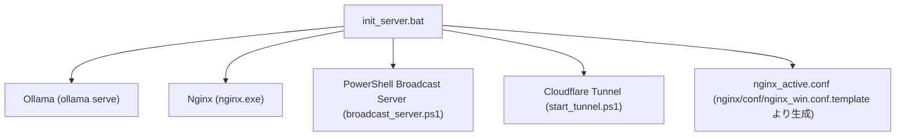

# 仕様書 - `init_server.bat`

## 概要
DDO Saba アプリケーションに必要なすべてのサーバープロセス（Ollama、Nginx、Cloudflare Tunnel、PowerShellブロードキャストサーバー）の起動、停止、再起動、ステータス確認を一元管理するバッチファイル。
コマンドライン引数によるサイレント制御と、引数なし実行時の対話型メニュー選択の両方をサポートする。

## 依存関係


## 引数仕様 (Command Line Arguments)

本スクリプトは第1引数として以下のオプションを受け取る（大文字小文字不問）。

### 1. `start`
すべてのプロセスを起動する。
- **処理フロー**:
  1. `DDO_SABA_TOKEN` が未定義の場合、自動生成（PowerShell RNG経由で32文字のランダムな16進数）またはユーザーに入力を求める。
  2. Ollamaがポート `11434` で待機していない場合、`ollama serve` をバックグラウンド起動。
  3. `nginx/nginx.exe` がローカル環境に存在しない場合、自動的に `bin/download_nginx.ps1` を呼び出して Nginx の公式ZIPファイルをダウンロード・配置する。
  4. `nginx/conf/nginx_win.conf.template` のトークンプレースホルダー（`__DDO_SABA_TOKEN__`）を現在のトークンに置換して `nginx/conf/nginx_active.conf` を生成。
  5. PowerShellブロードキャストサーバー（`bin/broadcast_server.ps1`）をバックグラウンド起動（PIDは `bin/broadcast.pid` に保存）。
  6. Nginxを生成された `nginx_active.conf` を用いてバックグラウンド起動。
  7. Cloudflare Tunnel（`bin/start_tunnel.ps1`）を起動（PIDは `bin/cloudflared.pid` に保存）。

* **Linux (`init_server.sh`) の処理フロー**:
  1. `DDO_SABA_TOKEN` が未定義の場合、自動生成（`openssl` または `python3` 等を用いて32文字のランダムトークンを生成）し、`DDO_SABA_TOKEN` 環境変数にエクスポート。
  2. システムに `nginx` コマンドが存在しない場合、親切な案内（apt/dnf/brewなどのインストール手順）を表示してエラー終了する。
  3. `ngx_http_js_module.so` モジュールをシステムパス（`/usr/lib/nginx/modules/`, `/usr/share/nginx/modules/`, `/usr/lib64/nginx/modules/`）から自動探索する。
  4. `nginx/conf/nginx_linux.conf.template` を元にプレースホルダー置換を行い、`nginx/conf/nginx_active.conf` を生成。
  5. cloudflared が存在しない場合、GitHubから環境（x86_64, arm64等）に適したバイナリを `/tmp/cloudflared` に自動ダウンロードして権限付与。
  6. Nginx および cloudflared をバックグラウンドで起動し、トンネルURLを表示してブラウザ自動起動を試みる。


### 2. `stop`
起動中のすべてのプロセスをクリーンアップ停止する（冪等性を保持）。
- **処理フロー**:
  1. Nginxの停止コマンド実行および残存 `nginx.exe` プロセスの強制終了（`taskkill /f /im nginx.exe`）。
  2. `bin/cloudflared.pid` に保存されたPIDによるCloudflare Tunnelの停止、および残存 `cloudflared.exe` の強制終了。
  3. `bin/broadcast.pid` に保存されたPIDによるPowerShellサーバーの停止、およびコマンドライン引数に `broadcast_server.ps1` を含むプロセスの強制終了。
  4. ポート `8088`（Nginx）およびポート `8089`（PowerShell Server）を使用している残存プロセスのスキャンと強制終了。
  5. 一時生成されたファイル（`nginx_active.conf`、各 `.pid` ファイル、`tunnel_output.log` など）のクリーンアップ。
  6. すでに停止済みで対象プロセスが存在しない場合でも、エラーコードを返さず正常終了（`exit 0`）する。

### 3. `restart`
`stop` 処理を実行し、その完全な終了・ファイル削除を確認・待機した後、`start` 処理を実行する。

### 4. `status`
各プロセスの稼働状態（起動中 / 停止中）をPIDと共に表示する。
- **スキャン対象**:
  - `Ollama` (ポート `11434` の検知)
  - `Nginx` (PIDファイルまたは `nginx.exe` 起動検知)
  - `PowerShell Broadcast Server` (PIDファイルまたは `broadcast_server.ps1` コマンドライン検知)
  - `Cloudflare Tunnel` (PIDファイルまたは `cloudflared.exe` 起動検知)

### 5. `--help` または `/?`
スクリプトの使用方法およびサポートされているオプションの説明を出力する。

---

## 引数なし実行時 (Interactive Menu Mode)
引数なしで実行された場合、コンソールに以下の選択メニューを表示し、ユーザーの入力（1〜5）を待機する。

```text
==============================================
 DDO Saba Server Control Panel
==============================================
 [1] Start Server   (起動)
 [2] Stop Server    (停止)
 [3] Restart Server (再起動)
 [4] Server Status  (ステータス確認)
 [5] Exit           (終了)
==============================================
Choose an option (1-5): 
```

入力された番号に対応する上記の引数処理を実行し、完了後に一時停止（`pause`）して結果を確認できるようにする。
入力が不正な場合は再入力を促す。

---

## 終了コード (Exit Codes)
- `0`: 処理が正常に完了した（または正常にサーバーを停止・起動完了した）。
- `1` 以上: 必須プロセスの起動失敗、権限エラー、ファイル欠損などの異常終了。
