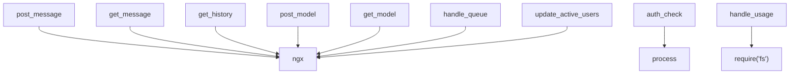

# Variable and Function Specifications: `broadcast.js`

This document specifies the variables and functions used in `nginx/conf/broadcast.js`, which handles temporary, stateless message exchanges and client authentication via Nginx JavaScript (njs).

---

## 1. Variables

### `ngx` (L2-2)
- **Type:** `Object` (NGINX Global Object)
- **Description:** The global Nginx object provided by the njs runtime. Accesses the shared dictionary zone `shared.broadcast_zone` which is allocated in memory to temporarily cache the latest broadcasted chat message. Key-value pairs in this zone automatically expire after 5 seconds.
- **Scope:** Global.

### `process` (L276-276)
- **Type:** `Object` (Global Process Object)
- **Description:** The process object provided by njs to access environmental variables. Accesses `env.DDO_SABA_TOKEN` to retrieve the access credential set by the server host.
- **Scope:** Global.

---

## 2. Functions

### `post_message` (L39-75)
- **Description:** Receives a HTTP `POST` request containing a chat message from a client, generates an ID and timestamp, stores it in the `ngx.shared.broadcast_zone` as `"latest"`, and appends it to the in-memory array under the key `"history"` (capped at 100 items).
- **Arguments:**
  - `r` (`Object`): The Nginx HTTP request object.
- **Return Value:** None (Sends HTTP response code `200` with confirmation JSON, or `400` on error).
- **Behavior:**
  1. Parses `r.requestBody` as JSON.
  2. Extracts `sender`, `broadcaster`, `role`, and `content`.
  3. Formulates a JSON string containing an `id` (using `body.id` if provided by the client, falling back to `Date.now().toString()`), the input message, and `timestamp`.
  4. Stores the string into `ngx.shared.broadcast_zone` under the key `"latest"`.
  5. Retrieves `"history"` JSON from `ngx.shared.broadcast_zone`, parses it (defaults to `[]`), pushes the new message, caps the array to the last 100 items, and serializes it back to the `"history"` key.
  6. Returns HTTP `200` with the resolved message ID.

### `get_message` (L77-112)
- **Description:** Receives a HTTP `GET` request and returns the latest message stored in the memory zone.
- **Arguments:**
  - `r` (`Object`): The Nginx HTTP request object.
- **Return Value:** None (Sends HTTP response code `200` with the cached JSON payload, or an empty JSON object `{}`).
- **Behavior:**
  1. Retrieves the string under `"latest"` from `ngx.shared.broadcast_zone`.
  2. Sets response `Content-Type` header to `application/json`.
  3. Returns the payload with HTTP status `200`.

### `get_history` (L114-120)
- **Description:** Receives a HTTP `GET` request and returns the entire active session history array.
- **Arguments:**
  - `r` (`Object`): The Nginx HTTP request object.
- **Return Value:** None (Sends HTTP response code `200` with history array JSON, or `[]` if none).
- **Behavior:**
  1. Retrieves the string under `"history"` from `ngx.shared.broadcast_zone`.
  2. Sets response `Content-Type` header to `application/json`.
  3. Returns the payload or `[]` with status `200`.

### `post_model` (L122-135)
- **Description:** Receives a HTTP `POST` request containing model details and real-time generation/sync status, and stores the raw JSON object string under the `"model"` key.
- **Arguments:**
  - `r` (`Object`): The Nginx HTTP request object.
- **Return Value:** None (Sends HTTP `200` or `400`).

### `get_model` (L137-143)
- **Description:** Receives a HTTP `GET` request and returns the stored raw JSON object representing the active model and real-time status details.
- **Arguments:**
  - `r` (`Object`): The Nginx HTTP request object.
- **Return Value:** None (Sends HTTP `200`).

### `auth_check` (L275-290)
- **Description:** Authenticates request headers targeting `/api/` endpoints by comparing the incoming token with the host-configured token.
- **Arguments:**
  - `r` (`Object`): The Nginx HTTP request object.
- **Return Value:** None (Sends HTTP response code `200` if authenticated, or `403` if unauthorized).
- **Behavior:**
  1. Retrieves `process.env.DDO_SABA_TOKEN`.
  2. If the expected token is empty, sends HTTP `200` (bypassed).
  3. Inspects header `X-DDO-Token`. If it matches the expected token, sends HTTP `200`.
  4. Otherwise, returns HTTP `403` with a forbidden message.

### `handle_queue` (L153-273)
- **Description:** Manages the shared inference queue in Mac/Linux environments using `ngx.shared.broadcast_zone` with `"queue"` key.
- **Arguments:**
  - `r` (`Object`): The Nginx HTTP request object.
- **Behavior:** Handles `GET` to list queue (with 120s timeout cleanup) and `POST` to `join`, `cancel`, and `complete` jobs.

### `handle_usage` (L275-325)
- **Description:** Receives a HTTP `POST` request containing token usage and inference duration statistics and appends the record to a local CSV file `../data/token_usage.csv`.
- **Arguments:**
  - `r` (`Object`): The Nginx HTTP request object.
- **Behavior:**
  1. Parses `r.requestBody` to extract `model`, `promptTokens`, `completionTokens`, `totalDurationSec`, `loadDurationSec`, `evalDurationSec`, and `status`.
  2. Extracts token and username from headers.
  3. Uses the `fs` module to check for/create the `../data` directory and `token_usage.csv` file.
  4. Appends a comma-separated, escaped string representing the usage event to the CSV.
  5. Returns HTTP `200` on success, or `500` on internal write error.

### `update_active_users` (L1-37)
- **Description:** On every API endpoint request, this function reads the client's token (`X-DDO-Token`) from headers, updates their last active timestamp in a JSON string stored in `ngx.shared.broadcast_zone` under the `"active_users"` key (using the token as the key instead of username to prevent duplicates on name changes), cleans up entries older than 10 seconds, and includes the active count in the response.

---

## 3. Dependency Mapping

---

## 4. Impact Scope
- **`nginx.conf`:** Relies on this file to be imported via `js_import conf/broadcast.js` and maps locations `/api/poll`, `/api/broadcast`, `/api/history`, `/api/model`, `/api/queue`, and `/api/usage` to the exported functions.
- **`app.tsx` / `useChatActions.ts`:** Client-side React app executes HTTP requests targeting `/api/poll`, `/api/broadcast`, `/api/history`, `/api/model`, `/api/queue`, and `/api/usage`.
- **`data/token_usage.csv`:** Output log file that records the metrics on host machine disk.