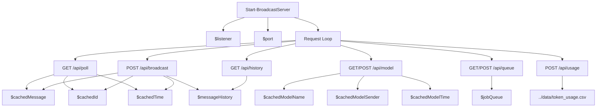

# broadcast_server.ps1 Specification

This script runs a lightweight in-memory broadcast relay server for Windows environments, acting as a dynamic njs fallback.

## Variables

### `$port`
- **Type:** `Int`
- **Description:** The local port number the HTTP Listener listens on. Default is `8089`.

### `$listener`
- **Type:** `System.Net.HttpListener`
- **Description:** The .NET HttpListener instance that listens for HTTP requests.

### `$messageHistory`
- **Type:** `Array`
- **Description:** An in-memory list storing the chronological sequence of all messages broadcasted within the active session. Used to sync client history.

### `$cachedModelName`
- **Type:** `String`
- **Description:** The name of the currently active model selected by any peer.

### `$cachedModelSender`
- **Type:** `String`
- **Description:** The username of the peer who made the last model selection.

### `$cachedModelTime`
- **Type:** `Double`
- **Description:** The epoch timestamp when the active model was updated.

### `$jobQueue`
- **Type:** `Array`
- **Description:** An in-memory queue containing the sequence of jobs currently waiting for execution.

### `$activeUsers`
- **Type:** `System.Collections.Hashtable`
- **Description:** Keeps track of each client's session ID (`X-DDO-Client-Id`) and their last active Unix epoch timestamp. If the client ID is missing from headers, it falls back to a concatenated ID using `X-DDO-Token` and `X-DDO-Username` headers (formatted as `$token + "_" + $username`) to count concurrent users without duplicates or omissions.
- **Active Timeout & Cache Reset:** Clean up users inactive for more than 10 seconds. If the user who selected the current active model (tracked in `$cachedModelData.sender`) becomes inactive, the model cache `$cachedModelData` is automatically reset to `$null` to prevent new users from misinterpreting the model as a peer change and triggering unnecessary auto-loads.
- **Active Count Header:** The response header `X-DDO-Active-Count` returns the exact number of active users, removing any minimum value constraints (which previously forced it to `1`).

## Functions

### `Start-BroadcastServer`
- **Description:** Initializes and starts the HTTP Listener loop, routing requests based on URLs.
- **Routes:**
  - `GET /api/poll`: `X-DDO-Since-Id` ヘッダーまたは `lastId` クエリパラメータから取得した `sinceId` 以降のメッセージ履歴（`$messageHistory` からフィルタされた配列）を JSON 配列で返す。`sinceId` が指定されていない場合は `$messageHistory` 全件を返す。差分メッセージがない場合は `204 No Content` を返す。
  - `POST /api/broadcast`: Reads the incoming JSON message body, appends the message to `$messageHistory` (automatically adding timestamp if missing), updates `$activeUsers`, and returns JSON `{ "status": "success", "id": "..." }`.
  - `GET /api/history`: Returns `$messageHistory` JSON, updates `$activeUsers` last active timestamp.
  - `POST /api/model`: Receives model change event `{ model, sender, timestamp }` and updates `$cachedModelName`, `$cachedModelSender`, and `$cachedModelTime`.
  - `GET /api/model`: Returns the active model cache JSON, updates `$activeUsers`.
  - `GET /api/queue`: Returns the current `$jobQueue` array. Automatically ejects expired running jobs (120s limit, or customizable via `X-DDO-Queue-Timeout` request header). Updates `$activeUsers`.
  - `POST /api/queue`: Accepts a JSON payload `{ action, id, username }` and updates `$jobQueue` accordingly. Automatically ejects expired running jobs before processing the payload (uses `X-DDO-Queue-Timeout` header if provided). Updates `$activeUsers`.
  - `POST /api/usage`: Accepts a JSON payload containing Ollama token counts and durations, and appends the usage record to a local CSV file `../data/token_usage.csv`.
  - `OPTIONS /api/poll` & `OPTIONS /api/broadcast` & `OPTIONS /api/history` & `OPTIONS /api/model` & `OPTIONS /api/queue` & `OPTIONS /api/usage`: Handles CORS preflight by returning CORS headers with `200 OK` or `204 No Content`.

## Impact Scope
- **`bin/broadcast_server.ps1`:** Handles `/api/usage` requests to log token counts and execution times into `data/token_usage.csv`. Also provides detailed `Write-Host` logs in PowerShell terminal.
- **`web-ui`:** Submits API usage metrics upon prompt completion or cancellation.
- **`data/token_usage.csv`:** Output file for performance and token auditing.

## Dependency Map

