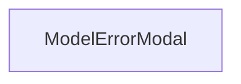

# 概要
`ModelErrorModal` は、サーバーのOllamaへのモデルのプリロード（VRAM読み込み）に失敗した際に、エラーの原因となるメッセージを表示するためのモーダルダイアログである。

# プロパティ (Props)
- `modelLoadError`: `string` - エラー内容を表す文字列。空文字列の場合はダイアログを非表示。
- `onClose`: `() => void` - モーダルを閉じるコールバック。

# 依存関係

