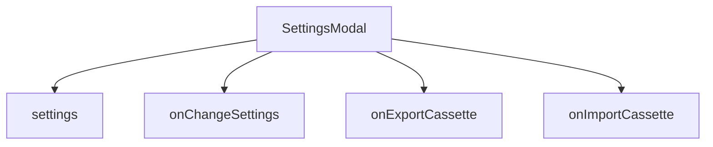

# Variable and Function Specifications: `components/SettingsModal.tsx`

This document specifies the popover modal logic for editing connection URLs, authentication access tokens, usernames, and import/export cassette procedures.

## Stylesheet
- `SettingsModal.css` [NEW]: Contains styles for the modal overlay, forms, inputs, and actions.

---

## 1. Component State and Props

### Props
- `show` (`boolean`): Whether the modal backdrop is active.
- `settings` (`DdoSettings`): Live config settings object.
- `onChangeSettings` (`(s: DdoSettings) => void`): Callback when values are changed in the fields.
- `sendOnEnter` (`boolean`): Current keyboard configuration state.
- `onChangeSendOnEnter` (`(v: boolean) => void`): Callback when the send-on-enter toggle switches.
- `onClose` (`() => void`): Closes the overlay backdrop.
- `onExportCassette` (`() => void`): Triggers file download of the current chat.
- `onImportCassette` (`(e: React.ChangeEvent<HTMLInputElement>) => void`): Handler triggered when local JSON files are uploaded.
- `t` (`LocaleStrings`): Localization language mappings.

---

## 2. Shared QR Code Feature
- Generates a QR Code image using an external API (`api.qrserver.com`) representing `${settings.connectionUrl}?token=${settings.accessToken}&sharedMode=${settings.isSharedMode}` for quick mobile client connection when `settings.connectionUrl` is a public URL (e.g., contains `.trycloudflare.com`).
- Displays descriptive instructions for connection:
  - Japanese: "このQRコードを他の端末のカメラでスキャンするだけで、トークンが自動認証された状態でアクセスできます。"
  - English: "Scan this QR code with another device's camera to open DDO Saba with automatic token authentication."

---

## 3. Dependency Mapping

