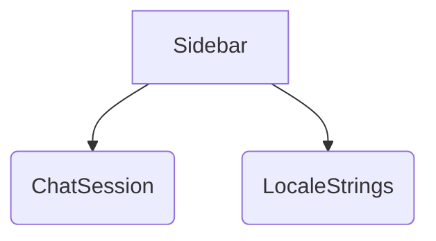

# 概要
`Sidebar` は、画面の左側に表示されるチャットセッション（タブ）の管理を行うコンポーネントである。チャットの新規作成、一覧表示、切り替え、削除をサポートする。

# プロパティ (Props)
- `chats`: `ChatSession[]` - 現在のチャットセッションのリスト。
- `activeChatId`: `string | null` - アクティブなチャットセッションのID。
- `isSidebarOpen`: `boolean` - モバイルビュー等でのサイドバー開閉状態。
- `onAddTab`: `(isRemote?: boolean) => void` - 新規チャット作成関数。
- `onSwitchTab`: `(id: string) => void` - チャット切り替え関数。
- `onDeleteTab`: `(id: string, e?: React.MouseEvent) => void` - チャット削除関数。
- `t`: `LocaleStrings` - 多言語対応辞書オブジェクト。

# 状態
内部状態は持たず、プロパティとして受け取ったデータに基づき描画を行う（Presentational Component）。

# 依存関係

