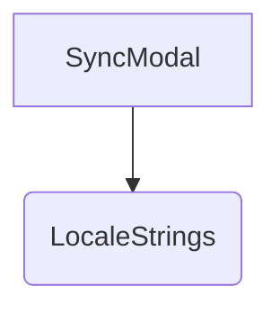

# 概要
`SyncModal` は、共有モードにおいて他クライアントからモデルやパラメータの同期（変更）リクエストが送信された際に、それを受け入れるか拒否するかをユーザーに確認させるポップアップダイアログである。

# プロパティ (Props)
- `syncRequestPending`: `any | null` - 同期リクエストの内容を含むオブジェクト。存在しない場合はダイアログを非表示。
- `onAccept`: `() => void` - 同期リクエストを承認するコールバック。
- `onReject`: `() => void` - 同期リクエストを拒否（キャンセル）するコールバック。
- `t`: `LocaleStrings` - 多言語対応辞書オブジェクト。

# 依存関係

