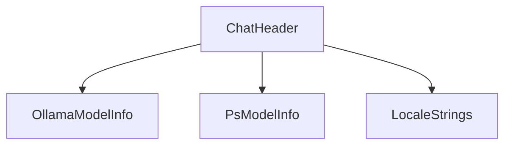

# 概要
`ChatHeader` は、チャット画面の上部に表示されるヘッダー領域のコンポーネ感である。モデルの選択、稼働状況の表示、VRAM解放ボタン、設定モーダルを開くボタンなどを提供する。

# プロパティ (Props)
- `activeModel`: `string` - 現在選択中のモデル名。
- `models`: `OllamaModelInfo[]` - サーバーから取得した利用可能なモデル一覧。
- `psInfo`: `PsModelInfo | null` - 現在VRAMにロードされているモデル情報。
- `isEffectivelyLoading`: `boolean` - モデルのロード中、またはローカル/リモートでの生成中かどうか。
- `onSelectModel`: `(modelName: string) => void` - モデル選択時のコールバック。
- `onUnloadModel`: `() => void` - モデルのVRAMアンロード時のコールバック。
- `onToggleSidebar`: `() => void` - サイドバー（チャットリスト）の開閉トグル。
- `onToggleParams`: `() => void` - パラメータパネルの開閉トグル。
- `onOpenSettings`: `() => void` - 設定モーダルを開く関数。
- `t`: `LocaleStrings` - 多言語対応辞書オブジェクト。

# 依存関係

