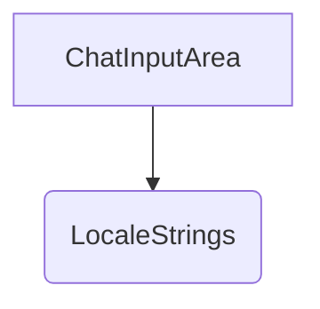

# 概要
`ChatInputArea` は、画面下部に配置されるテキスト入力エリア、送信・停止ボタン、簡易設定（共有モード切替・思考モード切替など）のトグルを提供するコンポーネントである。

# プロパティ (Props)
- `inputText`: `string` - 入力中のテキスト。
- `isGenerating`: `boolean` - 自身のクライアントで推論が実行中かどうかのフラグ。
- `isRemoteGenerating`: `boolean` - 共有モード時に他クライアントで推論が実行中かどうかのフラグ。共有モード時は、自身がキューで順番待ち、または生成中でない限り、他人が推論中であっても入力エリアはブロックされず、並行してキューに送信可能。
- `sendOnEnter`: `boolean` - Enterキーで送信するかのフラグ。
- `isSharedMode`: `boolean` - 共有ルームモードかどうかのフラグ。
- `thinkMode`: `boolean` - 思考モードが有効かどうかのフラグ。
- `myJobId`: `string | null` - 自身のキュー待機ID（待機中でない場合はnull）。
- `onChangeInput`: `(text: string) => void` - テキスト入力の変更を親に伝える。
- `onSend`: `() => void` - メッセージの送信処理を実行する。
- `onStop`: `() => void` - 自身の推論処理を停止する。
- `onCancelQueue`: `() => void` - 自身のキュー待機をキャンセルする。
- `onToggleSendOnEnter`: `() => void` - Enterキー送信設定の切替。
- `onToggleSharedMode`: `() => void` - 共有モードの切替。
- `onToggleThinkMode`: `() => void` - 思考モードの切替。
- `t`: `LocaleStrings` - 多言語対応辞書オブジェクト。

# 依存関係

