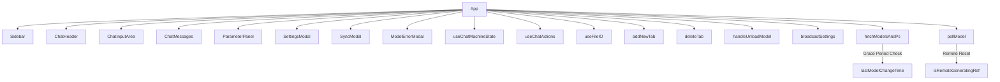

# Variable and Function Specifications: `app.tsx`

This document specifies the states, variables, and functions used in `web-ui/src/App.tsx`, which governs the main ChatUI coordination, tab management, and Ollama integration stream flows. After the refactoring, `App.tsx` delegates sub-functions to custom hooks (`useChatActions`, `useFileIO`) and UI components (`Sidebar`, `ChatHeader`, `ChatInputArea`, `SyncModal`, `ModelErrorModal`).

---

## 1. State Variables

Most state is managed via `useChatMachineState`. `App.tsx` extracts these states using the `adapters`.

### Shared States
Refer to `chatMachine.md` for the core state variables (e.g., `chats`, `activeChatId`, `settings`, `models`, `activeModel`, `systemPrompt`, `parameters`, `thinkMode`, `isGenerating`, `isRemoteGenerating`, `jobQueue`, `myJobId`).

### Local Refs
- **`isGeneratingRef`**, **`isRemoteGeneratingRef`**: React `useRef` holding active boolean values to prevent keep-alive resetting during generation.
- **`abortControllerRef`**: Ref holding the `AbortController` instance to cancel ongoing fetch requests.
- **`fallbackTimerRef`**: Ref holding the `NodeJS.Timeout` instance for the remote completion fallback timer (delaying remote text commit by 5 seconds to allow broadcast message receipt).
- **`prevIsSharedModeRef`**: Tracks the previous shared mode state to detect toggle transitions.
- **`messagesContainerRef`**: Tracks the scroll container to synchronize scrolling.
- **`isInitialized`** (`boolean`): State variable indicating that the web-ui has completed its mount cycle, parsed settings from the URL query parameters (e.g. `token`), and initialized the context. Used to guard API pollings.

---

## 1.1 API Poll Guards & Lifecycles

To prevent premature HTTP 403 Forbidden race conditions (sending requests with an empty token before the URL parser completes), all critical API polling loops are guarded:
- **`fetchModelsAndPs`**, **`startBroadcastPolling`**, **`pollQueue`**: Will not execute unless `isInitialized` is `true` and `settings.accessToken` is populated.
- **`beforeunload`**: When the window is closed, calls `/api/chat` with `keep_alive: '0s'` to immediately release Ollama VRAM if the client is the last active user.

---

## 2. Functions

### Custom Hooks
- **`useChatActions`**: Provides `runInferenceStream`, `sendMessage`, `handleCancelQueue`, `stopGeneration`.
- **`useFileIO`**: Provides `exportCassette`, `importCassette`, `exportPreset`, `importPreset`, `handleDropCassette`, `handleDragOver`.

### `addNewTab`
- **Description:** Spawns a new chat tab with a default blank history. If in Shared Room Mode, broadcasts a `tab_create:ID:Title` system message.
- **Arguments:**
  - `isRemote` (`boolean`): Whether the creation was triggered remotely.
  - `remoteId` (`string`, optional)
  - `remoteTitle` (`string`, optional)
- **Return Value:** `void`

### `deleteTab`
- **Description:** Closes and deletes a specific chat session. If in Shared Room Mode, broadcasts a `tab_delete:ID` system message.
- **Arguments:**
  - `id` (`string`): Target chat session ID.
  - `e` (`React.MouseEvent`, optional): Click event.
  - `isRemote` (`boolean`): Whether the deletion was triggered remotely.
- **Return Value:** `void`

### `handleUnloadModel`
- **Description:** Unloads the currently active model from Ollama VRAM by hitting the API, updates `psInfo`, triggers `fetchModelsAndPs`, and clears `activeModel`.
- **Arguments:** None.
- **Return Value:** `Promise<void>`

### `broadcastSettings`
- **Description:** Broadcasts current parameters and active model to all connected clients under a `sync_request` message event.
- **Arguments:** None.
- **Return Value:** `Promise<void>`

### `handleAcceptSyncRequest`
- **Description:** Approves the pending sync request, updates local settings/parameters state, and initiates model loading if the synchronized model differs from active.
- **Arguments:** None.
- **Return Value:** `void`

### `loadModelOnSelection`
- **Description:** Initiates pre-loading of a model into VRAM when selected from the dropdown. Sets `isModelLoading` and `modelLoadError` during the process.
- **Arguments:**
  - `modelName` (`string`)
- **Return Value:** `Promise<void>`

### `fetchModelsAndPs`
- **Description:** Fetches tags and ps info from Ollama. Automatically clears `activeModel` if the model has vanished from VRAM (psInfo is null), but implements a **15 seconds grace period** since the last model change (tracked via `lastModelChangeTime`) to prevent premature reset during the initial load lag.

### `pollModel` (polling loop)
- **Description:** Runs on a recursive `setTimeout` loop. Polls the broadcast model and generation state. Sets `isRemoteGenerating` and `remoteGeneratingText` from peer state. If the broadcast model payload is sent by the local client itself (`data.sender === settings.username`), updates to `isRemoteGenerating` and `remoteGeneratingText` are skipped to prevent duplicate AI response windows. On remote generation end, triggers `peerCompleteGenerate` and schedules a 5-second fallback timer (`fallbackTimerRef`) to append the remote text into chat history if the corresponding broadcast message doesn't arrive in time (guarded against duplicate entries by verifying the last 5 messages). Clears `activeModel` globally if the broadcast model payload is empty.

---

## 3. Dependency Mapping

---

## 4. Impact Scope

- `web-ui/src/App.tsx`: Manages the lifecycle of UI states. Setting a 15s grace period inside `fetchModelsAndPs` prevents the model selection dropdown from clearing itself immediately after a model finishes loading. Polling message handling now correctly persists message IDs (`id: data.id`) and implements duplicate prevention check (`some` logic) to prevent duplicate rendering of assistant messages. Remote model changes (`pollModel` loop) now also initiate `loadModelOnSelection` to ensure models are preloaded into Ollama on peer devices when synchronized. The hardcoded language mapping has been extracted to `./i18n` to simplify the component file.
- `web-ui/src/components/ChatInputArea.tsx` and sending actions: Ensuring `activeModel` is not prematurely cleared ensures that users can type and send messages successfully without encountering blank model check failures.
- `web-ui/src/hooks/useChatActions.ts`: Relies on `chats`, `activeModel`, and generation states from `App.tsx`. Safety improvements to generation states ensure `isGeneratingRef.current` is consistently freed, preventing deadlock on sending messages. Also, broadcasts user and assistant messages with local message IDs attached to synchronize message identity.

