# Variable and Function Specifications: `app.tsx`

This document specifies the states, variables, and functions used in `web-ui/src/App.tsx`, which governs the main ChatUI coordination, tab management, and Ollama integration stream flows. After the refactoring, `App.tsx` delegates sub-functions to custom hooks (`useInitializeSettings`, `useModelSync`, `useQueueSync`, `useBroadcastSync`, `useTabManagement`, `useChatActions`, `useFileIO`) and UI components (`Sidebar`, `ChatHeader`, `ChatInputArea`, `SyncModal`, `ModelErrorModal`).

---

## 1. State Variables

Most state is managed via `useChatMachineState`. `App.tsx` extracts these states using the `adapters`.

### Shared States
Refer to `chatMachine.md` for the core state variables (e.g., `chats`, `activeChatId`, `settings`, `models`, `activeModel`, `systemPrompt`, `parameters`, `thinkMode`, `isGenerating`, `isRemoteGenerating`, `jobQueue`, `myJobId`).

### Local Refs
- **`isGeneratingRef`**, **`isRemoteGeneratingRef`**: React `useRef` holding active boolean values to prevent keep-alive resetting during generation.
- **`abortControllerRef`**: Ref holding the `AbortController` instance to cancel ongoing fetch requests.
- **`fallbackTimerRef`**: Ref holding the `NodeJS.Timeout` instance for the remote completion fallback timer (delaying remote text commit by 5 seconds to allow broadcast message receipt).
- **`prevIsSharedModeRef`**: Tracks the previous shared mode state to detect toggle transitions.
- **`messagesContainerRef`**: Tracks the scroll container to synchronize scrolling.

---

## 1.1 API Poll Guards & Lifecycles

To prevent premature HTTP 403 Forbidden race conditions (sending requests with an empty token before the URL parser completes), all critical API polling loops are guarded inside the respective sync hooks by checking `isInitialized` and `settings.accessToken`.
- **`beforeunload`**: When the window is closed, calls `/api/chat` with `keep_alive: '0s'` to immediately release Ollama VRAM if the client is the last active user.

---

## 2. Functions

### Custom Hooks
- **`useInitializeSettings`**: Bootstrap hook to parse URL settings and initialize context.
- **`useModelSync`**: Periodically polls tags/ps info and synchronizes peer model selection and remote generating status.
- **`useQueueSync`**: Periodically polls `/api/queue` to sync the current queue status.
- **`useBroadcastSync`**: Periodically polls `/api/message` to sync messages and dispatch system tab events.
- **`useTabManagement`**: Provides `addNewTab` and `deleteTab` functions with broadcast actions.
- **`useChatActions`**: Provides `runInferenceStream`, `sendMessage`, `handleCancelQueue`, `stopGeneration`.
- **`useFileIO`**: Provides `exportCassette`, `importCassette`, `exportPreset`, `importPreset`, `handleDropCassette`, `handleDragOver`.

### `handleUnloadModel`
- **Description:** Unloads the currently active model from Ollama VRAM by hitting the API, updates `psInfo`, and clears `activeModel`.
- **Arguments:** None.
- **Return Value:** `Promise<void>`

### `broadcastSettings`
- **Description:** Broadcasts current parameters and active model to all connected clients under a `sync_request` message event.
- **Arguments:** None.
- **Return Value:** `Promise<void>`

### `handleAcceptSyncRequest`
- **Description:** Approves the pending sync request, updates local settings/parameters state, and initiates model loading if the synchronized model differs from active.
- **Arguments:** None.
- **Return Value:** `void`

### `loadModelOnSelection`
- **Description:** Initiates pre-loading of a model into VRAM when selected from the dropdown. Sets `isModelLoading` and `modelLoadError` during the process.
- **Arguments:**
  - `modelName` (`string`)
- **Return Value:** `Promise<void>`

---

## 3. Dependency Mapping

```mermaid
graph TD
    App --> Sidebar
    App --> ChatHeader
    App --> ChatInputArea
    App --> ChatMessages
    App --> ParameterPanel
    App --> SettingsModal
    App --> SyncModal
    App --> ModelErrorModal

    App --> useChatMachineState
    App --> useInitializeSettings
    App --> useModelSync
    App --> useQueueSync
    App --> useBroadcastSync
    App --> useTabManagement
    App --> useChatActions
    App --> useFileIO

    App --> handleUnloadModel
    App --> broadcastSettings
    App --> loadModelOnSelection
```

---

## 4. Impact Scope

- `web-ui/src/App.tsx`: Refactored to act strictly as a View Binder / Composition Root. The component size has been reduced from ~1000 lines to ~620 lines, resulting in cleaner react render cycles and clearer logical separations.
- `web-ui/src/hooks/useInitializeSettings.ts`, `useModelSync.ts`, `useQueueSync.ts`, `useBroadcastSync.ts`, `useTabManagement.ts`: Created new encapsulated hooks to cleanly isolate individual business logic and API polling tasks, drastically improving testability and robustness.

