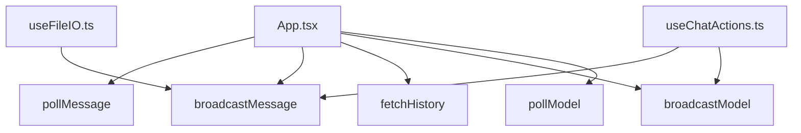

# Variable and Function Specifications: `api/broadcast.ts`

This document specifies the helper functions for room broadcasting (sharing messages) using Nginx's custom dict endpoints.

## 0. Dependency Mapping & Impact Scope

### Dependency Mapping

### Impact Scope
- **`api/broadcast.ts`:** レスポンスが 204 No Content や空ボディの場合に `res.json()` が SyntaxError を起こさないよう、テキストの存在を確認してから JSON にパースする安全な処理に変更。また、複数端末でのメッセージIDの一致を図るため `broadcastMessage` に `id` パラメータを追加。さらに、日本語などの非ASCII文字を安全に送信するため、ヘッダーにセットするユーザー名（`sender`）に `encodeURIComponent` を適用。
- **`App.tsx` / `useChatActions.ts` / `useFileIO.ts`:** 戻り値の形式は変わらないため、これらの呼び出し元ファイルへの機能的影響はなく、安定性が向上。また `broadcastMessage` 呼び出し時にメッセージIDを渡すように変更。

---

## 1. Functions

### `pollMessage` (L12-36)
- **Description:** Pulls the latest room message from `/api/poll`.
- **Arguments:**
  - `connectionUrl` (`string`): Host URL.
  - `accessToken` (`string`): Access token (added for auth verification).
- **Return Value:** `Promise<any>`

### `broadcastMessage` (L38-64)
- **Description:** Sends local user or assistant message to `/api/broadcast` for other peers to capture.
- **Arguments:**
  - `connectionUrl` (`string`): Host URL.
  - `accessToken` (`string`): Access token (added for auth verification).
  - `sender` (`string`): Username signature (URL-encoded via `encodeURIComponent` before setting to header).
  - `broadcaster` (`string`): Username of the broadcasting peer.
  - `role` (`string`): Message owner ('user' or 'assistant').
  - `content` (`string`): Message body.
  - `id` (`string` | `undefined`): Unique identifier of the message to prevent duplication.
- **Return Value:** `Promise<{ status: string; id: string }>`

### `fetchHistory` (L66-86)
- **Description:** Requests the full chronological list of messages broadcasted in the shared room from `/api/history`.
- **Arguments:**
  - `connectionUrl` (`string`): Host URL.
  - `accessToken` (`string`): Access token (added for auth verification).
- **Return Value:** `Promise<any>`

### `broadcastModel` (L88-112)
- **Description:** Notifies other peers of a model selection change by posting `{ model, sender, timestamp }` to `/api/model`.
- **Arguments:**
  - `connectionUrl` (`string`): Host URL.
  - `accessToken` (`string`): Access token (added for auth verification).
  - `sender` (`string`): Username signature (URL-encoded via `encodeURIComponent` before setting to header).
  - `model` (`string`): Selected model name.
  - `timestamp` (`number`): Millisecond timestamp of the model change.
- **Return Value:** `Promise<void>`

### `pollModel` (L114-134)
- **Description:** Pulls the current active model and selection meta (including the millisecond timestamp) from `/api/model`.
- **Arguments:**
  - `connectionUrl` (`string`): Host URL.
  - `accessToken` (`string`): Access token (added for auth verification).
- **Return Value:** `Promise<{ model?: string; sender?: string; timestamp?: number }>`