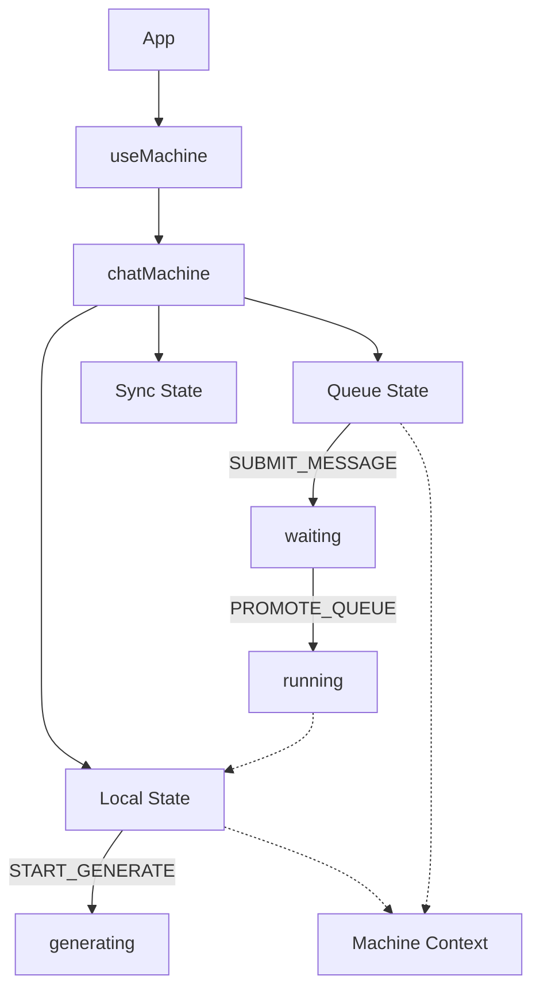

# Variable and Function Specifications: `chatMachine.ts`

This document specifies the states, context, and events used in `web-ui/src/machines/chatMachine.ts`.

---

## 1. Machine Context

The `context` holds the quantitative data managed by the state machine.

### `activeModel`
- **Type:** `string`
- **Description:** The currently selected active model. Automatically cleared when unloaded successfully.

### `activeUserCount`
- **Type:** `number`
- **Description:** Tracks the current number of active users connected to the shared room.
- **Default:** `1`

### `jobQueue`
- **Type:** `Array<QueueJob>`
- **Description:** Holds the list of active jobs in the inference queue.

### `myJobId`
- **Type:** `string | null`
- **Description:** Tracks the unique ID of the user's active job in the queue.

### `chats`
- **Type:** `Array<ChatSession>`
- **Description:** Holds all active temporary chat tabs.

### `syncRequestPending`
- **Type:** `any | null`
- **Description:** Holds pending settings sync request data received from other clients.

### `pendingMessage`
- **Type:** `string`
- **Description:** Holds the content of the user's message while it is waiting in the queue.

### `inputText`
- **Type:** `string`
- **Description:** Holds the text currently inputted in the chat box.

---

## 2. Machine States (Parallel Architecture)

The machine consists of three parallel (orthogonal) state regions: `local`, `sync`, and `queue`.

### `local` Region
Manages local model loading and generation states.
- **`idle`**: The resting state.
- **`loadingModel`**: Entered when a model is being pre-loaded.
- **`generating`**: Entered during active local inference. Sets `isGenerating: true`.
- **`unloadingModel`**: Entered when unloading a model from VRAM.

### `sync` Region
Manages polling synchronization with the server.
- **`idle`**: Polling inactive.
- **`polling`**: Active polling. Listens for peer states.
- **`remoteGenerating`**: Entered when another client is generating. Sets `isRemoteGenerating: true`. Guarded by `!isGenerating`.

### `queue` Region
Manages the user's message submission and queue sequence.
- **`idle`**: Ready to send a message.
- **`waiting`**: Message is submitted and waiting in the queue. Input is locked.
- **`running`**: Job is promoted to running. User's message is appended to chat and inference begins.

---

## 3. Events

### `SUBMIT_MESSAGE`
- **Description:** Emitted when a user submits a prompt.
- **Payload:** `{ content: string }`

### `PROMOTE_QUEUE`
- **Description:** Emitted when the user's job becomes the active job in the queue.

### `CANCEL_QUEUE`
- **Description:** Emitted when the user cancels their waiting job in the queue.

### `GENERATE_COMPLETE`
- **Description:** Emitted when local inference finishes.

### `GENERATE_ABORT`
- **Description:** Emitted when local inference is cancelled or errors out.

### `PEER_START_GENERATE`
- **Description:** Emitted when a remote client starts generation. Guarded by `!isGenerating`.

### `PEER_COMPLETE_GENERATE`
- **Description:** Emitted when a remote client finishes generation, resetting remote generation flags.

### `UPDATE_CONTEXT`
- **Description:** Generic event to update context fields.

---

## 4. Dependency Mapping

