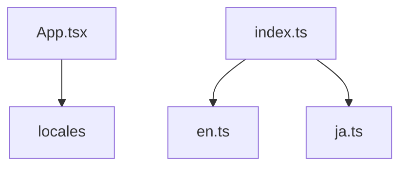

# Variable and Function Specifications: `i18n/index.ts`

This document specifies the main entry point for the translation resources, exporting all supported language packs.

---

## 1. Dependency Mapping & Impact Scope

### Dependency Mapping

---

## 2. Variables

### `locales`
- **Type:** `Record<'en' | 'ja', LocaleStrings>`
- **Description:** A consolidated mapping containing the supported locales (`en` and `ja`). Imported directly by components like `App.tsx` to handle dynamic language rendering on state updates.
