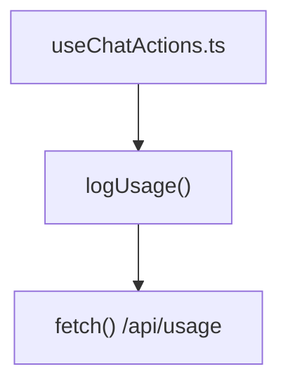

# usage.ts 仕様書

Ollamaでのトークン消費量や推論時間をサーバー側へログ出力として通知するためのAPIクライアントモジュール。

## 依存関係 (Dependency Map)



## エクスポート関数

### `logUsage`

トークン使用量メトリクスをサーバーにPOST送信する。

#### 型定義

```typescript
export function logUsage(
  connectionUrl: string,
  accessToken: string,
  payload: {
    model: string;
    promptTokens: number;
    completionTokens: number;
    totalDurationSec: number;
    loadDurationSec: number;
    evalDurationSec: number;
    status: string;
  }
): Promise<void>;
```

#### 引数

* `connectionUrl`: 接続先サーバーのベースURL。
* `accessToken`: 認証用のDDOトークン（ヘッダー `X-DDO-Token` に設定される）。
* `payload`: 記録する使用量メトリクスオブジェクト。
  * `model`: 使用された推論モデル名。
  * `promptTokens`: 入力（プロンプト）のトークン数。
  * `completionTokens`: 出力（生成結果）のトークン数。
  * `totalDurationSec`: 総処理秒数。
  * `loadDurationSec`: モデルロード秒数。
  * `evalDurationSec`: 生成秒数。
  * `status`: 推論の終了ステータス（`success` / `error` / `cancelled`）。

#### 戻り値

`Promise<void>`
