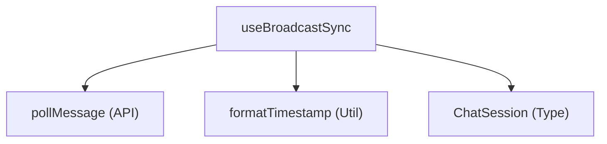

# 仕様書 - `useBroadcastSync`

## 概要
共有モード時に、中継サーバーのメッセージエンドポイント `/api/message` をポーリング監視し、チャットメッセージの同期、および各種システムイベント（タブ作成、削除、切り替え、設定同期リクエスト）の受信・適用を行うカスタムフック。

## 依存関係

## 引数 (Arguments)
- `isInitialized`: `boolean`
  設定初期化完了フラグ。
- `settings`: `DdoSettings`
  接続先URLやユーザー名などの設定オブジェクト。
- `activeChatId`: `string | null`
  現在アクティブなチャットセッションID。
- `lastPolledMsgId`: `string`
  最後に取得したメッセージのID。
- `updateLastPolledMsgId`: `(id: string) => void`
  最後に取得したメッセージIDを XState コンテキストなどの親状態に反映するための更新関数。
- `fallbackTimerRef`: `React.MutableRefObject<ReturnType<typeof setTimeout> | null>`
  他端末生成テキストのコミット用の遅延タイマー Ref。
- `setChats`: `React.Dispatch<React.SetStateAction<ChatSession[]>>`
  受信メッセージをチャット履歴に追加するための更新関数。
- `setIsRemoteGenerating`: `(val: boolean) => void`
  他端末の生成中ステータスをリセットするための更新関数。
- `setRemoteGeneratingText`: `(text: string) => void`
  他端末の生成中テキストをリセットするための更新関数。
- `setSyncRequestPending`: `(payload: any) => void`
  受信した設定同期リクエストを一時適用保留状態にするための関数。
- `addNewTab`: `(isRemote?: boolean, remoteId?: string, remoteTitle?: string) => void`
  他端末でのタブ作成イベント受信時に、ローカルのタブを追加するための関数。
- `deleteTab`: `(id: string, e?: React.MouseEvent, isRemote?: boolean) => void`
  他端末でのタブ削除イベント受信時に、ローカルのタブを削除するための関数。
- `setActiveChatId`: `(id: string | null) => void`
  他端末でのタブ切り替えイベント受信時に、ローカルのアクティブタブを切り替えるための関数。
- `handleActiveCount`: `(count: number) => void`
  アクティブユーザー数を同期するための関数。

## 戻り値 (Returns)
- なし。

## 主要な処理
1. **新着メッセージポーリング (1.5秒毎)**:
   - `pollMessage` を用いて、`lastPolledMsgId` 以降の新着メッセージをポーリング取得。
   - 自分が送信したメッセージ（`sender === username`）は処理をスキップ（二重適用防止）。
2. **システムイベント同期の解釈**:
   - `role === 'system'` かつ `content` のプレフィックスが指定文字で始まるメッセージを解釈し、対応する状態を同期。
     - `sync_request:sender:payload`: 他ユーザーからの設定同期要請を受信し、`setSyncRequestPending` にペイロードを保存。
     - `tab_create:id:title`: `addNewTab` を呼び出し、他端末で作られたチャットタブをローカルに再現。
     - `tab_delete:id`: `deleteTab` を呼び出し、他端末で削除されたタブをローカルでも削除。
     - `tab_switch:id`: `setActiveChatId` を呼び出し、他端末のタブ切り替えにローカルのアクティブチャットを追従させる。
3. **一般チャットメッセージの追記**:
   - 新着の `user` または `assistant` ロールのメッセージを、現在アクティブなチャットセッション（`activeChatId`）のメッセージ配列の末尾に追記。
   - `assistant` のメッセージを受信した場合は、他端末での一時生成中状態（`setIsRemoteGenerating(false)`）と遅延コミットタイマーを解除する。
4. **クリーンアップ**:
   - アンマウント時にポーリングタイマーを確実に `clearTimeout` で解除する。
