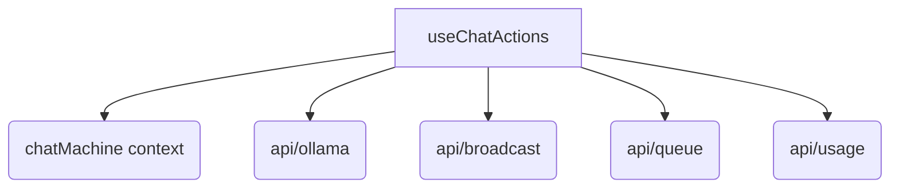

# 概要
`useChatActions` は、チャットの送信、推論の中止、キューへの参加およびキャンセルなど、推論APIとの対話に関するアクションを管理するカスタムフックである。

## 依存関係

## 関数仕様

### `sendMessage` 
- **役割:** ユーザーからの入力を受け取り、チャットセッションにメッセージを追加。共有モードの場合はキューに参加し、推論の順番を待つか直ちにブロードキャストを行う。
- **引数:**
  - `inputText`: `string` - ユーザーが入力したテキスト。
- **戻り値:** `Promise<void>`

### `stopGeneration`
- **役割:** 現在実行中の推論プロセスを中止し、UI状態を待機状態へ戻す。また、使用量ログにステータス `cancelled` として推論処理時間等を記録する。
- **引数:** なし
- **戻り値:** `void`

### `handleCancelQueue`
- **役割:** 自分がキューに入って順番待ちをしている状態（推論開始前）に、待機をキャンセルする。
- **引数:** なし
- **戻り値:** `Promise<void>`

### `runInferenceStream`
- **役割:** 実際の推論ストリーム処理を実行し、UIのチャットログを更新しながらレスポンスを表示する。推論完了またはエラー終了時に `logUsage` を呼び出して使用量を記録する。また、`finally` ブロックでは `completeQueue` の非同期待ちを行う前に、同期的に `myJobId` および `pendingMessage` のクリア（クリーンアップ）を行うことで、完了中の重複発火バグを回避する。さらに、Ollamaのストリーム接続において、受信したテキストパケットを行バッファリングで制御し、不完全に分割されたJSONL行を結合パースすることで情報の欠落を防止する。
- **引数:**
  - `jobId`: `string` - 実行対象のジョブID。
- **戻り値:** `Promise<void>`
