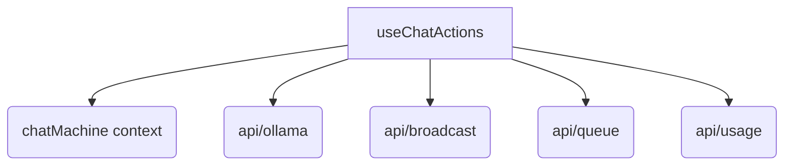

# 概要
`useChatActions` は、チャットの送信、推論の中止、キューへの参加およびキャンセルなど、推論APIとの対話に関するアクションを管理するカスタムフックである。

## 依存関係

## 引数 (Props)

`UseChatActionsProps` に以下のパラメータが定義されている：
- `chats`: `ChatSession[]` - 現在のチャット履歴セッションの配列。
- `activeChatId`: `string | null` - アクティブなチャットセッションのID。
- `settings`: `DdoSettings` - 共有モードや認証情報を含む設定オブジェクト。
- `activeModel`: `string` - 選択されているアクティブモデル名。
- `systemPrompt`: `string` - 現在のシステムプロンプト。
- `pendingMessage`: `string` - キュー待機中の一時メッセージ。
- `parameters`: `DdoParameters` - 生成パラメータ。
- `thinkMode`: `'off' | 'on' | 'think'` - 思考プロセス出力モード。
- `numPredictEnabled`: `boolean` - 推論トークン数制限が有効か。
- `myJobId`: `string | null` - 自分のジョブID。
- `inputText`: `string` - 入力中のテキスト。
- `isGeneratingRef`: `React.MutableRefObject<boolean>` - 生成中フラグのRef。
- `abortControllerRef`: `React.MutableRefObject<AbortController | null>` - アボートコントローラのRef。
- `t`: `any` - 翻訳オブジェクト。
- `setChats`, `setIsGenerating`, `setModelLoadError`, `setPendingMessage`, `setMyJobId`, `setJobQueue`, `setInputText`, `setContextUsed`, `updateLastPolledMsgId` - 各状態更新用のコールバック。
- `startGenerate`: `() => void` - XStateに生成開始を通知する。
- `completeGenerate`: `() => void` - XStateに生成の正常終了を通知する。
- `abortGenerate`: `() => void` - XStateに生成の中止・エラーを通知する。

## 関数仕様

### `sendMessage` 
- **役割:** ユーザーからの入力を受け取り、チャットセッションにメッセージを追加。共有モードの場合はキューに参加し、推論の順番を待つか直ちにブロードキャストを行う。
- **引数:**
  - `inputText`: `string` - ユーザーが入力したテキスト。
- **戻り値:** `Promise<void>`

### `stopGeneration`
- **役割:** 現在実行中の推論プロセスに対して `AbortController` 経由でシグナルを送信し、推論を強制中断します（サーバーAPIへの直接キャンセルリクエスト送信やキュー更新は行わず、中継サーバーへのリクエスト送信は `runInferenceStream` の `finally` 処理へ完全に委譲・一元化します）。
- **引数:** なし
- **戻り値:** `void`

### `handleCancelQueue`
- **役割:** 自分がキューに入って順番待ちをしている状態（推論開始前）に、待機をキャンセルする。
- **引数:** なし
- **戻り値:** `Promise<void>`

### `runInferenceStream`
- **役割:** 実際の推論ストリーム処理を実行し、UIのチャットログを更新しながらレスポンスを表示する。内部で `isAborted` フラグを保持し、推論が中断（AbortError）された場合は `isAborted` を `true` にします。推論開始時および終了時にそれぞれ `startGenerate`, `completeGenerate`, `abortGenerate` コールバックを呼び出して XState マシンの状態遷移を行います。また、共有モードにおけるユーザーメッセージおよびアシスタントメッセージのブロードキャスト成功時に、`updateLastPolledMsgId` を呼び出して即座に自身の同期カーソルを前進させ、メッセージの重複受信を防ぎます。推論完了またはエラー終了時に `logUsage` を呼び出して使用量を記録します。また、`finally` ブロックでは `myJobId` および `pendingMessage` の同期的なクリアに加え、**`isAborted` に基づいて `cancelQueue`（キャンセル時）または `completeQueue`（正常完了時）のいずれか一方のみを一元的に呼び出し**、その後に `fetchQueue` と `setJobQueue` を行うことで、同時書き込み/二重送信による競合とスタック状態を防ぎます。さらに、Ollamaのストリーム接続において、受信したテキストパケットを行バッファリングで制御し、不完全に分割されたJSONL行を結合パースすることで情報の欠落を防止します。
- **引数:**
  - `jobId`: `string` - 実行対象のジョブID。
- **戻り値:** `Promise<void>`
