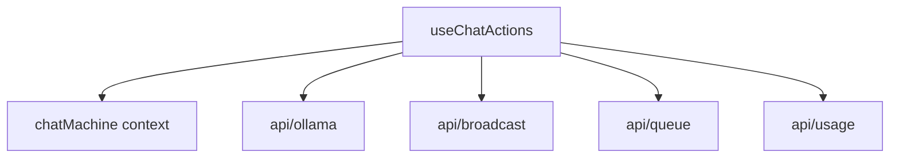

# Variable and Function Specifications: `useChatActions.ts`

`useChatActions` は、チャットの送信、推論の中止、キューへの参加およびキャンセルなど、推論APIとの対話に関するアクションを管理するカスタムフックである。

---

## 1. 依存関係

---

## 2. 引数 (Props)

`UseChatActionsProps` に以下のパラメータが定義されている：
- `chats`: `ChatSession[]` - 現在のチャット履歴セッションの配列。
- `activeChatId`: `string | null` - アクティブなチャットセッションのID。
- `settings`: `DdoSettings` - 共有モードや認証情報を含む設定オブジェクト。
- `activeModel`: `string` - 選択されているアクティブモデル名。
- `systemPrompt`: `string` - 現在のシステムプロンプト。
- `pendingMessage`: `string` - キュー待機中の一時メッセージ。
- `parameters`: `DdoParameters` - 生成パラメータ。
- `thinkMode`: `boolean` - 思考プロセス出力モード。
- `numPredictEnabled`: `boolean` - 推論トークン数制限が有効か。
- `myJobId`: `string | null` - 自分のジョブID。
- `inputText`: `string` - 入力中のテキスト。
- `isGeneratingRef`: `React.MutableRefObject<boolean>` - 生成中フラグのRef。
- `abortControllerRef`: `React.MutableRefObject<AbortController | null>` - アボートコントローラのRef。
- `t`: `LocaleStrings` - 翻訳オブジェクト。

- `setChats`, `setModelLoadError`, `setPendingMessage`, `setMyJobId`, `setJobQueue`, `setInputText`, `setContextUsed`, `updateLastPolledMsgId` - 各状態更新用のコールバック。
- `startGenerate`: `() => void` - XStateに生成開始を通知する。
- `completeGenerate`: `() => void` - XStateに生成の正常終了を通知する。
- `abortGenerate`: `() => void` - XStateに生成の中止・エラーを通知する。

---

## 3. 関数仕様

### `sendMessage`
- **役割:** ユーザーからの入力を受け取ります。共有モード時は、メッセージを即座にチャット履歴に追加せず、状態マシンに `SUBMIT_MESSAGE` を送信して待機状態に入ります。その後、非同期で `joinQueue` を実行し、APIの呼び出しに失敗した（例外がスローされた）場合は、状態マシンに `CANCEL_QUEUE` を送信して待機状態を `idle` へ自動ロールバックします。非共有モード時は即座に推論をトリガーします。
- **引数:**
  - `inputTextValue`: `string` - ユーザーが入力したテキスト。
- **戻り値:** `Promise<void>`

### `stopGeneration`
- **役割:** 現在実行中の推論プロセスに対して `AbortController` 経由でシグナルを送信し、推論を強制中断します。
- **引数:** なし
- **戻り値:** `void`

### `handleCancelQueue`
- **役割:** 自分がキューに入って順番待ちをしている状態（推論開始前）に、待機をキャンセルします。履歴のメッセージ削減は行わず、状態マシンに `CANCEL_QUEUE` を送信します。
- **引数:** なし
- **戻り値:** `Promise<void>`

### `runInferenceStream`
- **役割:** 実際の推論ストリーム処理を実行し、UIのチャットログを更新しながらレスポンスを表示します。接続開始前に30秒のタイムアウトタイマーを設定し、接続応答がない場合は `AbortController` 経由でリクエストをアボートしてマシンの状態を `idle` に戻します。
- **引数:**
  - `jobId`: `string` - 実行対象のジョブID。
- **戻り値:** `Promise<void>`