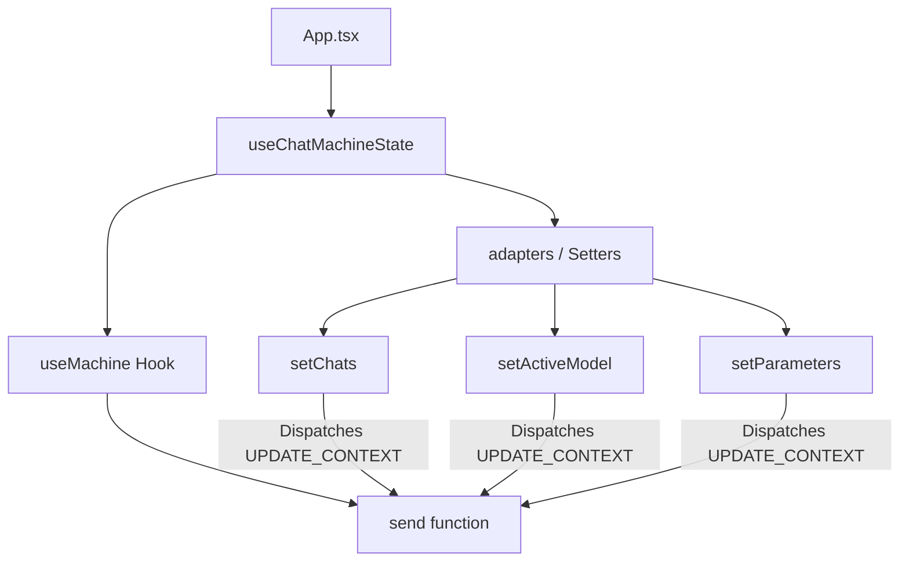

# Variable and Function Specifications: `useChatMachineState.ts`

This document specifies the React hook `useChatMachineState` defined in `web-ui/src/hooks/useChatMachineState.ts`. This hook acts as a bridge between the XState machine `chatMachine` and the React component tree, providing typed state access and optimized adapter functions (setters).

---

## 1. Functions & Exports

### `useChatMachineState` (L6-170)
- **Type:** `() => { state: AnyState, send: Function, adapters: Record<string, Function> }`
- **Description:** Initializes the `chatMachine` using `@xstate/react`'s `useMachine` and returns the state, send function, and a mapping of React-style state setters.

---

## 2. Adapter Functions (Setters)

Every adapter function wraps the XState `send` call by dispatching an `UPDATE_CONTEXT` event. To prevent React stale closure bugs, all adapter functions are memoized with `useCallback` depending ONLY on `[send]`. They do not depend on the current values of `state.context` fields.

### `setChats` (L113-115)
- **Signature:** `(val: ChatSession[] | ((prev: ChatSession[]) => ChatSession[])) => void`
- **Description:** Updates the list of chats in context. Dispatches a function or value to the state machine.

### `setActiveModel` (L45-47)
- **Signature:** `(val: string | ((prev: string) => string)) => void`
- **Description:** Updates the currently active model name.

### `setParameters` (L53-55)
- **Signature:** `(val: DdoParameters | ((prev: DdoParameters) => DdoParameters)) => void`
- **Description:** Updates the model inference parameters.

### `setIsModelLoading` (L33-35)
- **Signature:** `(val: boolean | ((prev: boolean) => boolean)) => void`
- **Description:** Updates the loading state indicator of the active model.

*(Other adapters include `setIsSidebarOpen`, `setIsParamsOpen`, `setPresetName`, `setInputText`, `setShowSettingsModal`, `setNumPredictEnabled`, `setModelLoadError`, `setCollapseThinking`, `setSystemPrompt`, `setThinkMode`, `setSyncRequestPending`, `setIsRemoteGenerating`, `setRemoteGeneratingText`, `setPsInfo`, `setIsGenerating`, `setSendOnEnter`, `setContextUsed`, `setLastModelChangeTime`, `setLastModelSender`, `setJobQueue`, `setMyJobId`, `setPendingMessage`, `setActiveUserCount`, `setActiveChatId`, `setSettings`, `setModels`, `setExpandedThinking`)*

### `startGenerate`
- **Signature:** `() => void`
- **Description:** Dispatches `START_GENERATE` to transition `local` state to `generating` and set `isGenerating: true`.

### `completeGenerate`
- **Signature:** `() => void`
- **Description:** Dispatches `GENERATE_COMPLETE` to transition `local` state to `idle` and set `isGenerating: false`.

### `abortGenerate`
- **Signature:** `() => void`
- **Description:** Dispatches `GENERATE_ABORT` to transition `local` state to `idle` and set `isGenerating: false`.

### `peerStartGenerate`
- **Signature:** `() => void`
- **Description:** Dispatches `PEER_START_GENERATE` to transition `sync` state to `remoteGenerating` and set `isRemoteGenerating: true`.

### `peerCompleteGenerate`
- **Signature:** `() => void`
- **Description:** Dispatches `PEER_COMPLETE_GENERATE` to transition `sync` state to `polling`, set `isRemoteGenerating: false`, and clear the remote buffer.

---

## 3. Dependency Mapping

---

## 4. Impact Scope

- `App.tsx`: Consumes `useChatMachineState` to access state machine variables and pass adapter functions down to UI components and other hooks.
- `useChatActions.ts` and `useFileIO.ts`: Receive these adapters as properties. Because the adapters no longer change their references on state updates (due to `[send]` dependency only), these hooks will not be unnecessarily recreated, and non-blocking asynchronous loops can execute updates without data races or state rollbacks.