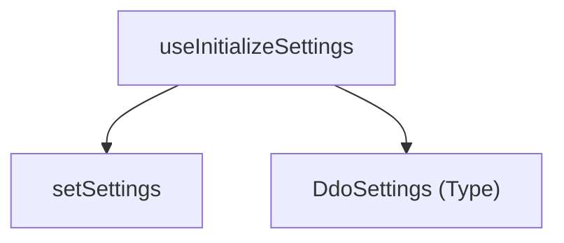

# 仕様書 - `useInitializeSettings`

## 概要
起動時にURLクエリパラメータ（`token` や `sharedMode`）をパースし、アプリの初期設定 `settings` を初期化して、初期化完了フラグ `isInitialized` を管理・返却するカスタムフック。

## 依存関係

## 引数 (Arguments)
- `setSettings`: `React.Dispatch<React.SetStateAction<DdoSettings>>`
  アプリの基本設定オブジェクト `settings` を更新するためのセッター関数。

## 戻り値 (Returns)
- `isInitialized`: `boolean`
  設定の初期化が完了したかどうかを示すフラグ。初期化完了後に `true` になる。

## 主要な処理
1. コンポーネントのマウント時に `useEffect` が走り、`window.location.search` をパース。
2. URLクエリパラメータから `token`、`accessToken`、`sharedMode`、`isSharedMode` などの値を取得。
3. `setSettings` を使用して、取得したパラメータを反映させた設定オブジェクトを適用する。ホスト名が `localhost:3000` の場合は接続先 URL を `http://localhost:8088` に自動設定する。また `username` としてランダムなゲスト名（例：`Guest_123`）を生成して付与する。
4. 処理の最後に `isInitialized` を `true` に更新して返す。
