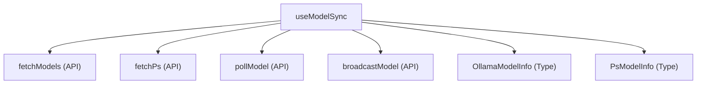

# 仕様書 - `useModelSync`

## 概要
Ollamaサーバーの VRAM ロードモデル状態（`psInfo`）およびモデル一覧（`models`）を定期ポーリングし、他ユーザーとの選択モデル同期および生成中ステータスの同期処理をカプセル化するカスタムフック。

## 依存関係

## 引数 (Arguments)
- `isInitialized`: `boolean`
  初期設定が完了したかのフラグ。これが `true` になるまでポーリング処理はガードされる。
- `settings`: `DdoSettings`
  接続先URLやトークン、ユーザー名、共有モード設定などを含む設定オブジェクト。
- `activeModel`: `string`
  現在選択されているローカルのモデル名。
- `isModelLoading`: `boolean`
  現在モデルのロード処理中であるかを示すフラグ。
- `lastModelChangeTime`: `number`
  最後にモデルが変更されたタイムスタンプ（ミリ秒単位）。
- `lastModelSender`: `string`
  最後にモデル変更を送信したユーザー名。
- `isGeneratingRef`: `React.RefObject<boolean>`
  ローカルでの推論生成状態を保持する Ref オブジェクト。
- `isRemoteGeneratingRef`: `React.RefObject<boolean>`
  他端末での推論生成状態を保持する Ref オブジェクト。
- `remoteGeneratingText`: `string`
  他端末で生成中のテキスト。
- `activeChatId`: `string | null`
  現在アクティブなチャットセッションの ID。
- `fallbackTimerRef`: `React.MutableRefObject<ReturnType<typeof setTimeout> | null>`
  他端末の生成テキストをローカルへ確定コミットするための遅延タイマー Ref。
- `setModels`: `React.Dispatch<React.SetStateAction<OllamaModelInfo[]>>`
  取得したモデル一覧を状態適用するための更新関数。
- `setPsInfo`: `React.Dispatch<React.SetStateAction<PsModelInfo | null>>`
  取得したVRAMロードモデル状態を適用するための更新関数。
- `setActiveModel`: `(model: string) => void`
  アクティブモデルを変更するための更新関数。
- `setLastModelSender`: `(sender: string) => void`
  モデル変更送信ユーザー名を更新するための関数。
- `setLastModelChangeTime`: `(time: number) => void`
  モデル変更タイムスタンプを更新するための関数。
- `setIsRemoteGenerating`: `(val: boolean) => void`
  他端末生成中フラグを更新するための関数。
- `setRemoteGeneratingText`: `(text: string) => void`
  他端末生成中テキストを更新するための関数。
- `setChats`: `React.Dispatch<React.SetStateAction<ChatSession[]>>`
  チャットセッション状態を更新するための更新関数（他端末生成フォールバック用）。
- `peerStartGenerate`: `() => void`
  他端末が生成を開始した際のコールバック関数。
- `peerCompleteGenerate`: `() => void`
  他端末が生成を完了した際のコールバック関数。
- `handleActiveCount`: `(count: number) => void`
  現在のアクティブユーザー数を同期するための関数。

## 戻り値 (Returns)
- `fetchModelsAndPs`: `() => Promise<void>`
  OllamaサーバーからモデルとPS情報を手動で即時取得するための非同期関数。

## 主要な処理
1. **Ollamaサーバーポーリング (5秒毎)**:
   - `fetchModels` と `fetchPs` を定期実行し、モデル一覧と VRAM 上のロードモデル状態を更新。
   - VRAM からモデルが消えた際、一定の猶予時間（15秒）経過後にローカルの `activeModel` を自動でアンロードクリアする。
2. **共有モード時の他端末モデル・生成同期ポーリング (1.5秒毎)**:
   - `pollModel` を用いて他端末のモデル選択状態や、リモート生成状態（`isGenerating`, `generatingText`）を受信・同期。
   - 他人が推論中である場合は、`setIsRemoteGenerating(true)` や `setRemoteGeneratingText` を更新。
   - 他人の推論が完了した際、5秒のバッファタイマー `fallbackTimerRef` を経て、受信した生成テキストをローカルのチャット履歴に自動コミットする。
3. **アンマウント時のクリーンアップ**:
   - 定期ポーリング処理の `setInterval` や `setTimeout` は、フックのアンマウント時に確実にクリーンアップされる。
