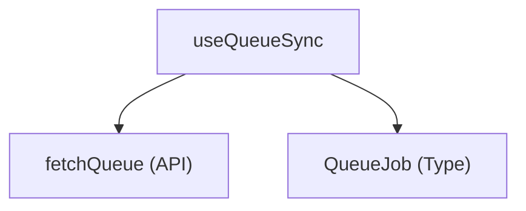

# 仕様書 - `useQueueSync`

## 概要
共有モード時に、中継サーバーの推論実行キュー `/api/queue` を定期監視し、待ち行列の状態（`jobQueue`）を同期・更新するカスタムフック。

## 依存関係

## 引数 (Arguments)
- `isInitialized`: `boolean`
  設定初期化完了フラグ。これが `true` になるまでポーリングはガードされる。
- `settings`: `DdoSettings`
  接続先URLやトークン、共有モードの設定オブジェクト。
- `setJobQueue`: `React.Dispatch<React.SetStateAction<QueueJob[]>>`
  取得したキューリストを状態反映するための更新関数。
- `handleActiveCount`: `(count: number) => void`
  現在のアクティブユーザー数を同期するための関数。

## 戻り値 (Returns)
- なし。

## 主要な処理
1. **キューポーリング (1.5秒毎)**:
   - 共有モード時かつ初期化完了時に、中継サーバーから `fetchQueue` を用いて現在のキューに並んでいるジョブリスト（`QueueJob`）を取得。
   - 取得結果を `setJobQueue` を介してローカル状態に適用。
2. **クリーンアップ**:
   - アンマウント時にポーリングタイマーを `clearTimeout` で確実にクリーンアップする。
