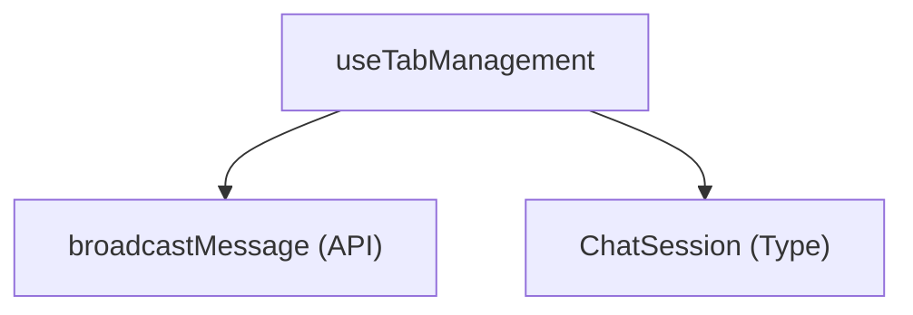

# 仕様書 - `useTabManagement`

## 概要
チャットタブ（チャットセッション）の追加および削除操作（CRUD）と、共有モード時のアクション中継送信処理をカプセル化するカスタムフック。

## 依存関係

## 引数 (Arguments)
- `chats`: `ChatSession[]`
  現在の全チャットセッションリスト。
- `settings`: `DdoSettings`
  接続先URLやユーザー名などの設定オブジェクト。
- `t`: `LocaleStrings`
  ローカライズ文字列リソース。
- `setChats`: `React.Dispatch<React.SetStateAction<ChatSession[]>>`
  チャットリストの状態を更新するための更新関数。
- `setActiveChatId`: `(id: string | null) => void`
  アクティブなチャットセッションIDを更新するための関数。
- `updateLastPolledMsgId`: `(id: string) => void`
  中継メッセージ送信後に、ローカルの取得済み最新メッセージIDを更新するための関数。

## 戻り値 (Returns)
- `addNewTab`: `(isRemote?: boolean, remoteId?: string, remoteTitle?: string) => void`
  新しいチャットセッションを追加するコールバック関数。
- `deleteTab`: `(id: string, e?: React.MouseEvent, isRemote?: boolean) => void`
  既存のチャットセッションを削除するコールバック関数。

## 主要な処理
1. **新規タブ追加 (`addNewTab`)**:
   - ランダムなID（または `remoteId`）と「新しいチャット + 連番」のタイトル（または `remoteTitle`）で `ChatSession` オブジェクトを作成し、`setChats` でリストの末尾に追加。
   - 作成したタブを `setActiveChatId` でアクティブにする。
   - 自身のアクション（`!isRemote`）かつ共有モード時は、中継サーバーへシステムメッセージ（`tab_create:id:title`）を送信し、他端末と同期する。
2. **タブ削除 (`deleteTab`)**:
   - `setChats` で指定された ID のセッションをフィルタ除去する。
   - 削除対象がアクティブだった場合は、残ったタブの末尾のタブに `setActiveChatId` で切り替える。その際、共有モードかつ自身のアクション時は他ユーザーの切り替え用メッセージ（`tab_switch:nextActiveId`）を中継送信する。
   - 自身のアクションかつ共有モード時は、中継サーバーへシステムメッセージ（`tab_delete:id`）を送信し、他端末へ同期する。
