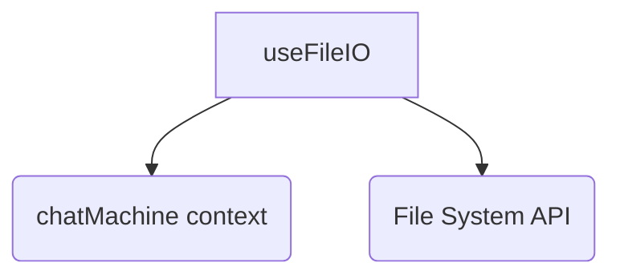

# 概要
`useFileIO` は、チャット履歴（カセット）や設定（プリセット）のエクスポートおよびインポートといった、ファイル入出力関連のロジックを管理するカスタムフックである。

# 依存関係

# 関数仕様

## `exportCassette`
- **役割:** 現在のチャットセッションの履歴、システムプロンプト、各種パラメータをJSONファイルとしてダウンロード（エクスポート）する。
- **引数:** なし
- **戻り値:** `void`

## `importCassette`
- **役割:** JSONファイルからチャット履歴、システムプロンプト、パラメータを読み込み、アプリケーション状態に反映させる。
- **引数:**
  - `file`: `File` - ユーザーが選択したカセットファイル。
- **戻り値:** `Promise<void>`

## `exportPreset`
- **役割:** 現在のパラメータ設定およびシステムプロンプトをJSONファイルとしてダウンロード（エクスポート）する。
- **引数:** なし
- **戻り値:** `void`

## `importPreset`
- **役割:** JSONファイルからプリセット設定（パラメータ、システムプロンプト）を読み込み、アプリケーション状態に反映させる。
- **引数:**
  - `file`: `File` - ユーザーが選択したプリセットファイル。
- **戻り値:** `Promise<void>`
