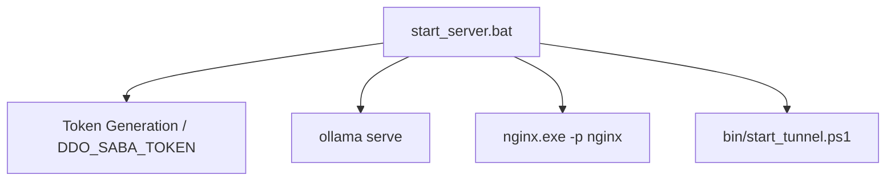

# Variable and Function Specifications: `start_server`

This document specifies the environment variables, external processes, and control flow for starting the DDO Saba server components (Ollama, Nginx, and Cloudflare Tunnel) on Windows (via Batch) and Unix-like environments (via Shell script).

---

## 1. Environment Variables and Settings

### `DDO_SABA_TOKEN`
- **Type:** `string` (6-digit random numeric string by default, or user-defined)
- **Description:** Access token required by clients to authenticate against proxy endpoints. Passed to Nginx via the host script's environment to allow verification in `/auth_check`.

---

## 2. Process Control Flow

### Windows (`start_server.bat`)
*   **Step 1:** Verifies if `DDO_SABA_TOKEN` is set; if empty, generates a random 6-character numeric token.
*   **Step 2:** Checks if Ollama is running on port `11434` (using `netstat`). If not, runs `ollama serve` in the background.
*   **Step 3:** Verifies Nginx njs module (`nginx\modules\ngx_http_js_module.dll`) existence.
*   **Step 4:** Starts Nginx with full features (`nginx\nginx.exe -p nginx`) or falls back to pre-defined no-njs configurations if modules are missing.
*   **Step 5:** Spawns a Cloudflare Tunnel using `bin\start_tunnel.ps1`.

---

## 3. Dependency Mapping

---

## 4. Impact Scope
*   **Ollama (11434):** Activates Ollama inference engine.
*   **Nginx (8088):** Hosts Web UI and proxy server endpoints.
*   **Cloudflare Tunnel:** Exposes port 8088 to the public edge networks.
