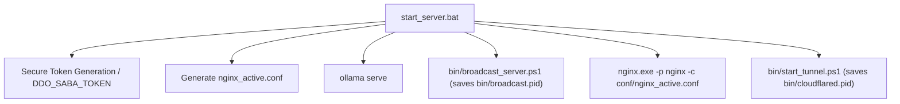

# Variable and Function Specifications: `start_server`

This document specifies the environment variables, external processes, and control flow for starting the DDO Saba server components (Ollama, Nginx, and Cloudflare Tunnel) on Windows (via Batch) and Unix-like environments (via Shell script).

---

## 1. Environment Variables and Settings

### `DDO_SABA_TOKEN`
- **Type:** `string` (32-character secure random hex string by default, or user-defined)
- **Description:** Access token required by clients to authenticate against proxy endpoints. Passed to Nginx via dynamic configuration substitution.

---

## 2. Process Control Flow

### Windows (`start_server.bat`)
*   **Step 1:** Verifies if `DDO_SABA_TOKEN` is set; if empty, runs a PowerShell command to generate a cryptographically secure 16-byte random hex string (32 characters).
*   **Step 2:** Checks if Ollama is running on port `11434` (using `netstat`). If not, runs `ollama serve` in the background.
*   **Step 3:** Generates the active configuration `nginx\conf\nginx_active.conf` from the template `nginx\conf\nginx_win.conf.template` by replacing `__DDO_SABA_TOKEN__` with the generated `DDO_SABA_TOKEN`.
*   **Step 4:** Starts the background PowerShell broadcast server (`bin\broadcast_server.ps1`) and saves its process ID to `bin\broadcast.pid`.
*   **Step 5:** Starts Nginx using the active configuration (`nginx\nginx.exe -p nginx -c conf\nginx_active.conf`). The Nginx process naturally manages its PID in `nginx\logs\nginx.pid`.
*   **Step 6:** Spawns a Cloudflare Tunnel using `bin\start_tunnel.ps1`.

### Linux (`start_server.sh`)
*   **Step 1:** Verifies if `DDO_SABA_TOKEN` is set; if empty, generates a cryptographically secure hex token using `openssl rand -hex 16` or `/dev/urandom`.
*   **Step 2:** Checks if Ollama is running on port `11434`. If not, runs `ollama serve` in the background.
*   **Step 3:** Generates `nginx/conf/nginx_active.conf` from the template `nginx/conf/nginx_linux.conf.template` by replacing the token and system `ngx_http_js_module.so` path.
*   **Step 4:** Starts Nginx using the active configuration, saving the Nginx master PID to `/tmp/ddo_saba_nginx.pid`.
*   **Step 5:** Starts Cloudflare Tunnel, saving its PID to `/tmp/ddo_saba_cloudflared.pid`.

---

## 3. Dependency Mapping

---

## 4. Impact Scope
*   **Ollama (11434):** Activates Ollama inference engine.
*   **Nginx (8088):** Hosts Web UI and proxy server endpoints.
*   **PowerShell Broadcast (8089):** Resolves Windows dynamic module incompatibility by providing a local broadcast channel.
*   **Cloudflare Tunnel:** Exposes port 8088 to the public edge networks.
