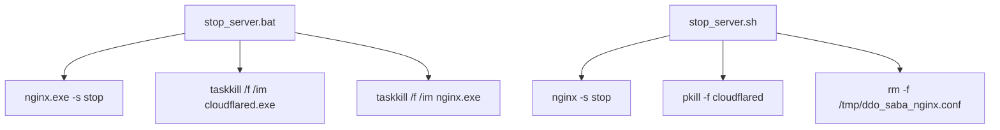

# Variable and Function Specifications: `stop_server`

This document specifies the process control, command parameters, and sequence flow for stopping the DDO Saba server components (Nginx and Cloudflare Tunnel) on Windows (via Batch) and Unix-like environments (via Shell script).

---

## 1. Process Control Flow

The shutdown operation targets specific background processes initiated by the startup scripts.

### Windows (`stop_server.bat`)
*   **Step 1:** Sends a stop signal to the active Nginx server using the native CLI.
    *   *Command:* `nginx\nginx.exe -p nginx -s stop`
*   **Step 2:** Forces termination of any running Cloudflare Tunnel daemon.
    *   *Command:* `taskkill /f /im cloudflared.exe`
*   **Step 3:** Forces cleanup of any stray Nginx zombie worker/master processes.
    *   *Command:* `taskkill /f /im nginx.exe`

### Linux/macOS (`stop_server.sh`)
*   **Step 1:** Discovers local Nginx configuration template path or uses active configuration parameters.
    *   *Command:* `nginx -p "$(pwd)/nginx" -c "/tmp/ddo_saba_nginx.conf" -s stop`
*   **Step 2:** Falls back to general CLI stops if default configurations fail.
    *   *Command:* `nginx -s stop`
*   **Step 3:** Force kills active cloudflared instances using process names.
    *   *Command:* `pkill -f "cloudflared"`
*   **Step 4:** Safely cleans up temporary configurations created during boot (e.g. `/tmp/ddo_saba_nginx.conf`).

---

## 2. Dependency Mapping

---

## 3. Impact Scope
*   **`nginx/` Port Allocation (8088):** Frees the HTTP listener port so that future instances can bind without encountering the `bind() to 0.0.0.0:8088 failed (10048: Only one usage of each socket address is normally permitted)` socket conflict.
*   **Cloudflare Tunnel Connection:** Gracefully severs the tunnel interface on `trycloudflare.com`, notifying the edge network that the local client has terminated its listener session.
