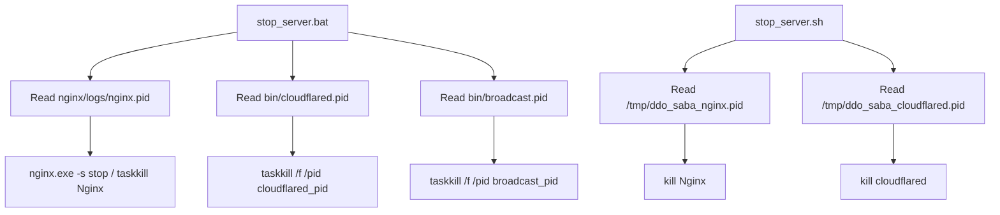

# Variable and Function Specifications: `stop_server`

This document specifies the process control, command parameters, and sequence flow for stopping the DDO Saba server components (Nginx, Cloudflare Tunnel, and PowerShell Broadcast Server) on Windows (via Batch) and Unix-like environments (via Shell script) using stored process IDs (PIDs).

---

## 1. Process Control Flow

The shutdown operation targets specific background processes initiated by the startup scripts.

### Windows (`stop_server.bat`)
*   **Step 1:** Discovers the Nginx process PID from `nginx\logs\nginx.pid` and terminates it gracefully.
    *   *Command:* `nginx\nginx.exe -p nginx -s stop` (sends a stop signal using the active pid).
    *   *Fallback command:* If Nginx process persists, reads PID and runs `taskkill /f /pid [nginx_pid]`.
*   **Step 2:** Discovers the Cloudflare Tunnel process PID from `bin\cloudflared.pid` and terminates it.
    *   *Command:* `taskkill /f /pid [cloudflared_pid]`
*   **Step 3:** Discovers the PowerShell Broadcast Server PID from `bin\broadcast.pid` and terminates it.
    *   *Command:* `taskkill /f /pid [broadcast_pid]`
*   **Step 4:** Deletes the generated PID files and the active configuration file `nginx\conf\nginx_active.conf`.

### Linux/macOS (`stop_server.sh`)
*   **Step 1:** Terminates Nginx using the saved PID in `/tmp/ddo_saba_nginx.pid`.
    *   *Command:* `kill -TERM $(cat /tmp/ddo_saba_nginx.pid)`
*   **Step 2:** Terminates Cloudflare Tunnel using the saved PID in `/tmp/ddo_saba_cloudflared.pid`.
    *   *Command:* `kill -TERM $(cat /tmp/ddo_saba_cloudflared.pid)`
*   **Step 3:** Cleans up active configurations and deletes temporary PID files.

---

## 2. Dependency Mapping

---

## 3. Impact Scope
*   **`nginx/` Port Allocation (8088):** Frees the HTTP listener port so that future instances can bind without socket conflict.
*   **`broadcast_server.ps1` Port Allocation (8089):** Frees port 8089 for future Windows broadcast sessions.
*   **Cloudflare Tunnel Connection:** Gracefully severs the tunnel interface on `trycloudflare.com` without leaving dangling background processes.
