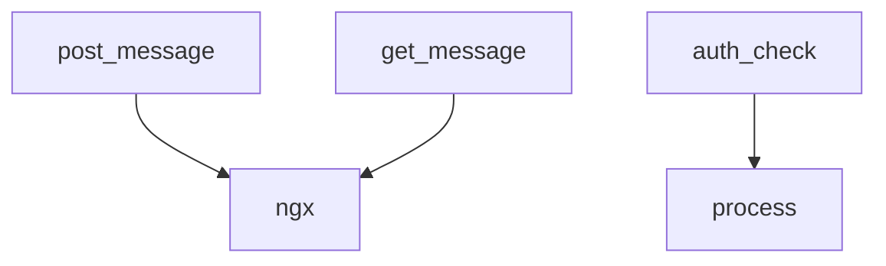

# Variable and Function Specifications: `broadcast.js`

This document specifies the variables and functions used in `nginx/conf/broadcast.js`, which handles temporary, stateless message exchanges and client authentication via Nginx JavaScript (njs).

---

## 1. Variables

### `ngx` (L2, L21, L22)
- **Type:** `Object` (NGINX Global Object)
- **Description:** The global Nginx object provided by the njs runtime. Accesses the shared dictionary zone `shared.broadcast_zone` which is allocated in memory to temporarily cache the latest broadcasted chat message. Key-value pairs in this zone automatically expire after 5 seconds.
- **Scope:** Global.

### `process` (L28)
- **Type:** `Object` (Global Process Object)
- **Description:** The process object provided by njs to access environmental variables. Accesses `env.DDO_SABA_TOKEN` to retrieve the access credential set by the server host.
- **Scope:** Global.

---

## 2. Functions

### `post_message` (L1-18)
- **Description:** Receives a HTTP `POST` request containing a chat message from a client, generates an ID and timestamp, and stores it in the `ngx.shared.broadcast_zone`.
- **Arguments:**
  - `r` (`Object`): The Nginx HTTP request object.
- **Return Value:** None (Sends HTTP response code `200` with confirmation JSON, or `400` on error).
- **Behavior:**
  1. Parses `r.requestBody` as JSON.
  2. Extracts `sender`, `role`, and `content`.
  3. Formulates a JSON string containing an `id` (using `Date.now()`), the input message, and `timestamp`.
  4. Stores the string into `ngx.shared.broadcast_zone` under the key `"latest"`.
  5. Returns HTTP `200` with the generated message ID.

### `get_message` (L20-25)
- **Description:** Receives a HTTP `GET` request and returns the latest message stored in the memory zone.
- **Arguments:**
  - `r` (`Object`): The Nginx HTTP request object.
- **Return Value:** None (Sends HTTP response code `200` with the cached JSON payload, or an empty JSON object `{}`).
- **Behavior:**
  1. Retrieves the string under `"latest"` from `ngx.shared.broadcast_zone`.
  2. Sets response `Content-Type` header to `application/json`.
  3. Returns the payload with HTTP status `200`.

### `auth_check` (L27-42)
- **Description:** Authenticates request headers targeting `/api/` endpoints by comparing the incoming token with the host-configured token.
- **Arguments:**
  - `r` (`Object`): The Nginx HTTP request object.
- **Return Value:** None (Sends HTTP response code `200` if authenticated, or `403` if unauthorized).
- **Behavior:**
  1. Retrieves `process.env.DDO_SABA_TOKEN`.
  2. If the expected token is empty, sends HTTP `200` (bypassed).
  3. Inspects header `X-DDO-Token`. If it matches the expected token, sends HTTP `200`.
  4. Otherwise, returns HTTP `403` with a forbidden message.

---

## 3. Dependency Mapping

---

## 4. Impact Scope
- **`nginx.conf`:** Relies on this file to be imported via `js_import conf/broadcast.js` and maps locations `/api/poll` and `/api/broadcast` to the exported functions `get_message` and `post_message`. Relies on `auth_check` mapped to location `/auth_check` under the `auth_request` module.
- **`app.tsx`:** Client-side React app executes HTTP requests targeting `/api/poll` and `/api/broadcast`, directly relying on the response structure established here. Must include `X-DDO-Token` in headers for all `/api/` fetch operations.