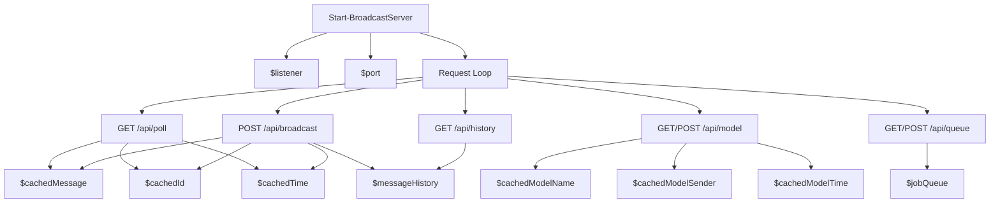

# broadcast_server.ps1 Specification

This script runs a lightweight in-memory broadcast relay server for Windows environments, acting as a dynamic njs fallback.

## Variables

### `$port`
- **Type:** `Int`
- **Description:** The local port number the HTTP Listener listens on. Default is `8089`.

### `$listener`
- **Type:** `System.Net.HttpListener`
- **Description:** The .NET HttpListener instance that listens for HTTP requests.

### `$cachedMessage`
- **Type:** `String` (JSON)
- **Description:** The last message posted to the broadcast API. Cached in memory.

### `$cachedId`
- **Type:** `String`
- **Description:** The unique ID of the last cached message.

### `$cachedTime`
- **Type:** `Double` (Unix timestamp)
- **Description:** The epoch timestamp when the message was cached. Used to expire messages after 5 seconds.

### `$messageHistory`
- **Type:** `Array`
- **Description:** An in-memory list storing the chronological sequence of all messages broadcasted within the active session. Used to sync client history.

### `$cachedModelName`
- **Type:** `String`
- **Description:** The name of the currently active model selected by any peer.

### `$cachedModelSender`
- **Type:** `String`
- **Description:** The username of the peer who made the last model selection.

### `$cachedModelTime`
- **Type:** `Double`
- **Description:** The epoch timestamp when the active model was updated.

### `$jobQueue`
- **Type:** `Array`
- **Description:** An in-memory queue containing the sequence of jobs currently waiting for execution.

### `$activeUsers`
- **Type:** `System.Collections.Hashtable`
- **Description:** Keeps track of each client's username and their last active Unix epoch timestamp to count concurrent users.

## Functions

### `Start-BroadcastServer`
- **Description:** Initializes and starts the HTTP Listener loop, routing requests based on URLs.
- **Routes:**
  - `GET /api/poll`: `X-DDO-Since-Id` ヘッダーまたは `lastId` クエリパラメータから取得した `sinceId` 以降のメッセージ履歴（`$messageHistory` からフィルタされた配列）を JSON 配列で返す。差分メッセージがない場合は `204 No Content` を返す。
  - `POST /api/broadcast`: Reads the incoming JSON message body, updates `$cachedMessage`, `$cachedId`, and `$cachedTime`, appends the message to `$messageHistory`, updates `$activeUsers`, and returns `200 OK`.
  - `GET /api/history`: Returns `$messageHistory` JSON, updates `$activeUsers` last active timestamp.
  - `POST /api/model`: Receives model change event `{ model, sender, timestamp }` and updates `$cachedModelName`, `$cachedModelSender`, and `$cachedModelTime`.
  - `GET /api/model`: Returns the active model cache JSON, updates `$activeUsers`.
  - `GET /api/queue`: Returns the current `$jobQueue` array. Automatically ejects expired running jobs (120s limit). Updates `$activeUsers`.
  - `POST /api/queue`: Accepts a JSON payload `{ action, id, username }` and updates `$jobQueue` accordingly. Updates `$activeUsers`.
  - `OPTIONS /api/poll` & `OPTIONS /api/broadcast` & `OPTIONS /api/history` & `OPTIONS /api/model` & `OPTIONS /api/queue`: Handles CORS preflight by returning CORS headers with `200 OK` or `204 No Content`.

## Impact Scope
- **`bin/broadcast_server.ps1`:** `/api/poll` (GET) のレスポンスを、単一メッセージオブジェクトの返却から、差分ID以降の履歴（配列）を返却する形式に修正。
- **`web-ui`:** `/api/poll` から返る配列を正しくパース・受信できるようになり、複数端末間のリアルタイムチャット同期が正常に機能する。

## Dependency Map

