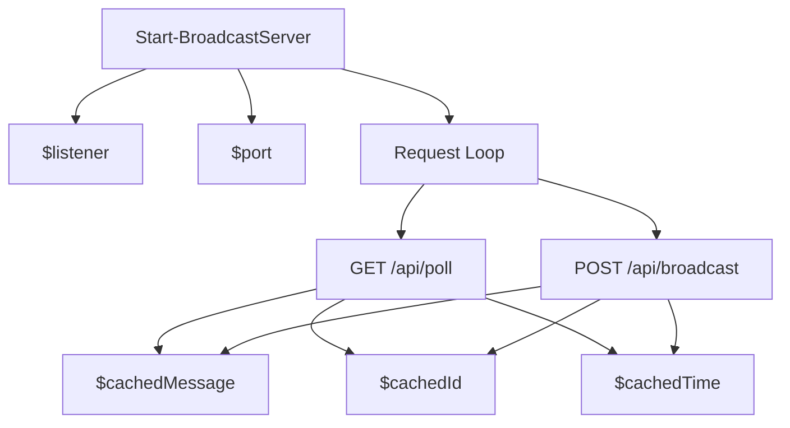

# broadcast_server.ps1 Specification

This script runs a lightweight in-memory broadcast relay server for Windows environments, acting as a dynamic njs fallback.

## Variables

### `$port`
- **Type:** `Int`
- **Description:** The local port number the HTTP Listener listens on. Default is `8089`.

### `$listener`
- **Type:** `System.Net.HttpListener`
- **Description:** The .NET HttpListener instance that listens for HTTP requests.

### `$cachedMessage`
- **Type:** `String` (JSON)
- **Description:** The last message posted to the broadcast API. Cached in memory.

### `$cachedId`
- **Type:** `String`
- **Description:** The unique ID of the last cached message.

### `$cachedTime`
- **Type:** `Double` (Unix timestamp)
- **Description:** The epoch timestamp when the message was cached. Used to expire messages after 5 seconds.

## Functions

### `Start-BroadcastServer`
- **Description:** Initializes and starts the HttpListener loop, routing requests based on URLs.
- **Routes:**
  - `GET /api/poll`: Returns the cached message if it has a newer ID than the client's query parameter, and if it has not expired (within 5 seconds).
  - `POST /api/broadcast`: Reads the incoming JSON message body, updates `$cachedMessage`, `$cachedId`, and `$cachedTime`, then returns `200 OK`.
  - `OPTIONS /api/poll` & `OPTIONS /api/broadcast`: Handles CORS preflight by returning CORS headers with `200 OK` or `204 No Content`.

## Dependency Map

