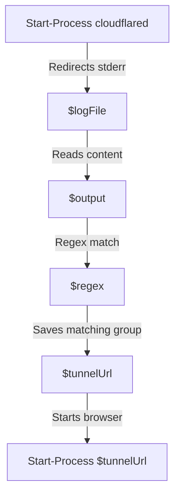

# Variable and Function Specifications: `start_tunnel.ps1`

This document specifies the variables and flow logic used in `bin/start_tunnel.ps1`, which executes Cloudflare Quick Tunnel on Windows and extracts the public URL.

---

## 1. Variables

### `$localPort`　
- **Type:** `Integer`
- **Description:** Port number of the local Nginx web server. Defaults to `8088`.
- **Scope:** Script-wide.

### `$logFile`
- **Type:** `String`
- **Description:** File path to temporarily store `cloudflared.exe` standard error logs (where the generated tunnel URL is printed). Defaults to `"tunnel_output.log"`.
- **Scope:** Script-wide.

### `$process`
- **Type:** `System.Diagnostics.Process`
- **Description:** Holds the process object of the launched `cloudflared.exe` instance. Used for process tracking.
- **Scope:** Script-wide.

### `$regex`
- **Type:** `String`
- **Description:** Regular expression pattern used to identify the TryCloudflare subdomain link. Matches `https://` followed by alphanumeric-hyphen characters and ending in `.trycloudflare.com`.
- **Scope:** Script-wide.

### `$output`
- **Type:** `String`
- **Description:** Temporarily stores the raw text content read from `$logFile`.
- **Scope:** Loop-local.

### `$tunnelUrl`
- **Type:** `String`
- **Description:** Holds the extracted TryCloudflare URL once parsed from the log file.
- **Scope:** Script-wide.

---

## 2. Process Flow Description

Since this is a PowerShell script, it runs procedurally rather than using custom functions:
1. Verifies if `$logFile` exists and removes it to clean old sessions.
2. Starts `bin/cloudflared.exe` with arguments `tunnel --url http://localhost:$localPort` using `Start-Process`. Redirects standard error output stream (`2>&1`) to `$logFile`.
3. Pauses script execution for 5 seconds using `Start-Sleep` to allow network handshake.
4. Enters a retry loop (runs up to 5 times, sleeping 2 seconds per cycle):
   - Reads `$logFile` content raw into `$output`.
   - Checks if `$output` matches `$regex`.
   - On match, stores the URL into `$tunnelUrl`, writes console notification in color, launches the URL in the default browser using `Start-Process $tunnelUrl`, and breaks the loop.

---

## 3. Dependency Mapping

---

## 4. Impact Scope
- **`start_server.bat`:** Directly executes this script via `powershell -ExecutionPolicy Bypass -File bin/start_tunnel.ps1`.
- **`app.tsx`:** Displays the extracted tunnel URL dynamically (if resolved).
