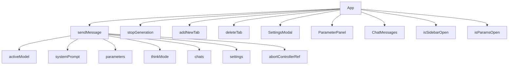

# Variable and Function Specifications: `app.tsx`

This document specifies the states, variables, and functions used in `web-ui/src/app.tsx`, which governs the main ChatUI coordination, tab management, and Ollama integration stream flows.

---

## 1. State Variables

All states defined below use React's `useState` or `useRef`.

### `chats`
- **Type:** `Array` of `ChatSession` objects
- **Description:** Holds all active temporary chat tabs.

### `activeChatId`
- **Type:** `string | null`
- **Description:** Tracks the ID of the currently selected and active chat tab.

### `settings`
- **Type:** `DdoSettings`
- **Description:** Tracks host configurations (connectionUrl, accessToken, isSharedMode, username).

### `models`
- **Type:** `Array` of `OllamaModelInfo`
- **Description:** List of installed models fetched from Ollama tags endpoint.

### `activeModel`
- **Type:** `string`
- **Description:** The currently selected active model.

### `systemPrompt`
- **Type:** `string`
- **Description:** Prompt instructions configured in the parameters column.

### `parameters`
- **Type:** `DdoParameters`
- **Description:** Model generation settings passed inside options payload.

### `thinkMode`
- **Type:** `boolean`
- **Description:** Toggles the global `"think"` parameter in the API payload.

### `psInfo`
- **Type:** `PsModelInfo | null`
- **Description:** Loaded VRAM/running metrics.

### `isGenerating`
- **Type:** `boolean`
- **Description:** Tracks if an inference streaming fetch is currently in progress.

### `isGeneratingRef`
- **Type:** `React.MutableRefObject<boolean>`
- **Description:** A React `useRef` holding the active `isGenerating` boolean value to prevent keep-alive resetting.

### `abortControllerRef`
- **Type:** `React.MutableRefObject<AbortController | null>`
- **Description:** Ref holding the `AbortController` instance to cancel ongoing fetch requests.

### `sendOnEnter`
- **Type:** `boolean`
- **Description:** Toggles the Enter key behavior shortcut.

### `contextUsed`
- **Type:** `number`
- **Description:** Tracks total token usage of the current chat message.

### `presetName`
- **Type:** `string`
- **Description:** Name assigned to the current preset parameters.

### `numPredictEnabled`
- **Type:** `boolean`
- **Description:** Toggles whether the `num_predict` parameter is included.

### `isModelLoading`
- **Type:** `boolean`
- **Description:** Tracks background model loading state.

### `modelLoadError`
- **Type:** `string`
- **Description:** Holds error messages when model loading fails.

### `collapseThinking`
- **Type:** `boolean`
- **Description:** Toggles whether CoT blocks default to collapsed.

### `lastPolledMsgId`
- **Type:** `string`
- **Description:** Tracks the ID of the last polled message in shared room mode.

### `lastPolledMsgIdRef`
- **Type:** `React.MutableRefObject<string>`
- **Description:** A React `useRef` holding `lastPolledMsgId` to avoid interval resets.

### `isSidebarOpen`
- **Type:** `boolean`
- **Description:** Tracks mobile left sidebar status.

### `isParamsOpen`
- **Type:** `boolean`
- **Description:** Tracks mobile right panel status.

---

## 2. Functions

### `sendMessage`
- **Description:** Initiates a chat request, sends user prompt, handles responses stream, and triggers Nginx broadcast.
- **Arguments:** None.
- **Return Value:** `Promise<void>`

### `stopGeneration`
- **Description:** Aborts the current streaming API request.
- **Arguments:** None.
- **Return Value:** `void`

### `addNewTab`
- **Description:** Spawns a new chat tab with a default blank history.
- **Arguments:** None.
- **Return Value:** `void`

### `deleteTab`
- **Description:** Closes and deletes a specific chat session.
- **Arguments:**
  - `id` (`string`): Target chat session ID.
- **Return Value:** `void`

---

## 3. Dependency Mapping

