# Variable and Function Specifications: `app.tsx`

This document specifies the states, variables, and functions used in `web-ui/src/app.tsx`, which governs the 3-column ChatUI interface, Ollama integration, cassette ingestion, and room broadcasting.

---

## 1. State Variables

All states defined below use React's `useState` or `useRef`.

### `chats`
- **Type:** `Array` of `ChatSession` objects
- **Description:** Holds all active temporary chat tabs. A `ChatSession` contains:
  - `id` (string)
  - `title` (string)
  - `messages` (Array of message objects `{"role": string, "content": string, "think"?: string}`)
- **Scope:** Local to the main application component.

### `activeChatId`
- **Type:** `string | null`
- **Description:** Tracks the ID of the currently selected and active chat tab displayed in the central panel.

### `settings`
- **Type:** `Object`
- **Description:** Tracks host configuration inside the settings popover:
  - `connectionUrl` (string, defaults to window origin or `http://localhost:8080`)
  - `accessToken` (string, for verification headers)
  - `isSharedMode` (boolean, triggers broadcast sync)
  - `username` (string, used as sender signature in broadcast)

### `models`
- **Type:** `Array` of strings
- **Description:** List of installed models fetched dynamically from `/api/tags`.

### `activeModel`
- **Type:** `string`
- **Description:** The currently selected model used for inference requests.

### `systemPrompt`
- **Type:** `string`
- **Description:** Prompt instructions configured in the parameters column.

### `parameters`
- **Type:** `Object`
- **Description:** Model generation settings passed inside the API payload `options` sub-object:
  - `temperature` (number, default: 0.7)
  - `num_ctx` (number, default: 2048)
  - `min_p` (number, default: 0.05)
  - `top_p` (number, default: 0.9)
  - `top_k` (number, default: 40)
  - `num_predict` (number, default: 1024)
  - `repeat_penalty` (number, default: 1.1)

### `thinkMode`
- **Type:** `boolean`
- **Description:** Toggles the global `"think"` parameter in the API payload to enable/disable model CoT reasoning.

### `psInfo`
- **Type:** `Object | null`
- **Description:** Loaded VRAM/running metrics retrieved from `/api/ps`.

### `isGenerating`
- **Type:** `boolean`
- **Description:** Tracks if an inference streaming fetch is currently in progress.

### `abortControllerRef`
- **Type:** `React.MutableRefObject<AbortController | null>`
- **Description:** A React `useRef` holding the `AbortController` instance to cancel ongoing fetch requests.

### `sendOnEnter`
- **Type:** `boolean`
- **Description:** Toggles the Enter key behavior: `true` sends the message on Enter (Shift+Enter for newline), `false` disables it.

### `contextUsed`
- **Type:** `number`
- **Description:** Tracks total token usage of the current chat message (prompt + response tokens).

### `presetName`
- **Type:** `string`
- **Description:** Tracks the custom name assigned to the current model generation parameters configuration.

### `numPredictEnabled`
- **Type:** `boolean`
- **Description:** Toggles whether the `num_predict` parameter is included in the Ollama request options payload.

### `isModelLoading`
- **Type:** `boolean`
- **Description:** Tracks if a background model pre-loading process is active.

---

## 2. Functions

### `sendMessage`
- **Description:** Initiates a chat request, sends user prompt, handles responses stream, and triggers Nginx broadcast if shared room mode is active.
- **Arguments:**
  - `content` (`string`): The user's input prompt text.
- **Return Value:** `Promise<void>`
- **Dependencies:** Relies on `chats`, `activeChatId`, `activeModel`, `systemPrompt`, `parameters`, `thinkMode`, and `settings`.

### `stopGeneration`
- **Description:** Aborts the current streaming API request.
- **Arguments:** None.
- **Return Value:** `void`
- **Dependencies:** Relies on `abortControllerRef`.

### `addNewTab`
- **Description:** Spawns a new chat tab with a default blank history.
- **Arguments:** None.
- **Return Value:** `void`
- **Dependencies:** Modifies `chats` and `activeChatId`.

### `deleteTab`
- **Description:** Closes and deletes a specific chat session.
- **Arguments:**
  - `id` (`string`): Target chat session ID.
- **Return Value:** `void`
- **Dependencies:** Modifies `chats` and `activeChatId`.

### `exportCassette`
- **Description:** Converts the active chat session (messages and options) into a JSON string and prompts a file download.
- **Arguments:** None.
- **Return Value:** `void`
- **Dependencies:** Relies on `chats`, `activeChatId`, `systemPrompt`, `parameters`, and `thinkMode`.

### `importCassette`
- **Description:** Ingests a JSON cassette file, parses the format, and loads it into the states.
- **Arguments:**
  - `file` (`File`): Uploaded JSON file.
- **Return Value:** `Promise<void>`
- **Dependencies:** Modifies `chats`, `systemPrompt`, `parameters`, and `thinkMode`.

### `startBroadcastPolling`
- **Description:** Periodically executes requests against `/api/poll` to fetch and render incoming messages from other clients in shared room mode.
- **Arguments:** None.
- **Return Value:** `void` (Cleaned up on unmount)
- **Dependencies:** Relies on `settings` and `chats`.

### `fetchModelsAndPs`
- **Description:** Pulls model tags and VRAM statuses from `/api/tags` and `/api/ps` to update UI widgets.
- **Arguments:** None.
- **Return Value:** `Promise<void>`
- **Dependencies:** Modifies `models` and `psInfo`.

### `unloadModel`
- **Description:** Sends a request to `/api/chat` with an empty message array and `keep_alive: 0` to unload the model from VRAM, then refreshes the model list.
- **Arguments:** None.
- **Return Value:** `Promise<void>`
- **Dependencies:** Relies on `psInfo`, `settings`.

### `CopyButton`
- **Description:** A helper component to copy raw markdown text to the clipboard, providing visual feedback (`copied` state) via icons.
- **Arguments:**
  - `text` (`string`): The text to copy.
- **Return Value:** JSX element.

### `parseMessageContent`
- **Description:** Parses chat message contents to extract `<think>` blocks, and delegates rendering to `renderMarkdownContent` for both thought processes and answers.
- **Arguments:**
  - `content` (`string`): The raw message content to parse.
- **Return Value:** JSX element.

### `renderMarkdownContent` (nested inside `parseMessageContent`)
- **Description:** Renders a given raw string as Markdown/LaTeX math with syntax-highlighted code blocks using `ReactMarkdown`, `remarkMath`, `rehypeKatex`, and `SyntaxHighlighter`.
- **Arguments:**
  - `txt` (`string`): Raw text to render.
- **Return Value:** JSX element.

### `formatBytes`
- **Description:** Helper utility converting numeric byte values to readable size text formats (MB, GB, TB).
- **Arguments:**
  - `bytes` (`number`): The raw byte size value.
- **Return Value:** `string`

### `loadModelOnSelection`
- **Description:** Sends background dummy POST requests to initialize target model loading directly in host Ollama VRAM.
- **Arguments:**
  - `modelName` (`string`): Target model configuration string.
- **Return Value:** `Promise<void>`
- **Dependencies:** Relies on `settings`, modifies `isModelLoading`.

### `exportPreset`
- **Description:** Bundles system prompts, parameters, think mode, key shortcut configurations, and preset names into a JSON object and triggers local browser file download.
- **Arguments:** None.
- **Return Value:** `void`
- **Dependencies:** Relies on `presetName`, `systemPrompt`, `parameters`, `thinkMode`, `sendOnEnter`, `numPredictEnabled`.

### `importPreset`
- **Description:** Parses an uploaded JSON file and applies configured system prompt, parameters, and preset names.
- **Arguments:**
  - `e` (`React.ChangeEvent<HTMLInputElement>`): Trigger event containing target file metadata.
- **Return Value:** `void`
- **Dependencies:** Modifies `presetName`, `systemPrompt`, `parameters`, `thinkMode`, `sendOnEnter`, `numPredictEnabled`.

---

## 3. Dependency Mapping

```mermaid
graph TD
    sendMessage --> activeModel
    sendMessage --> systemPrompt
    sendMessage --> parameters
    sendMessage --> thinkMode
    sendMessage --> chats
    sendMessage --> settings
    sendMessage --> abortControllerRef

    stopGeneration --> abortControllerRef

    exportCassette --> chats
    exportCassette --> systemPrompt
    exportCassette --> parameters
    exportCassette --> thinkMode

    importCassette --> chats
    importCassette --> systemPrompt
    importCassette --> parameters
    importCassette --> thinkMode

    startBroadcastPolling --> settings
    startBroadcastPolling --> chats

    fetchModelsAndPs --> models
    fetchModelsAndPs --> psInfo
    fetchModelsAndPs --> settings

    addNewTab --> chats
    addNewTab --> activeChatId

    deleteTab --> chats
    deleteTab --> activeChatId

    unloadModel --> psInfo
    unloadModel --> settings

    parseMessageContent --> renderMarkdownContent

    exportPreset --> presetName
    exportPreset --> systemPrompt
    exportPreset --> parameters
    exportPreset --> thinkMode
    exportPreset --> sendOnEnter
    exportPreset --> numPredictEnabled

    importPreset --> presetName
    importPreset --> systemPrompt
    importPreset --> parameters
    importPreset --> thinkMode
    importPreset --> sendOnEnter
    importPreset --> numPredictEnabled

    loadModelOnSelection --> settings
    loadModelOnSelection --> isModelLoading
```

---

## 4. Impact Scope
- **`index.html`:** The HTML structure binds event triggers directly to the React components rendering the logic defined in this file.
- **`style.css`:** Interacts with HTML classes dynamically toggled based on the states of `isGenerating`, active tabs, and parameters.
- **`nginx/conf/nginx.conf`:** Resolves API calls originating from `sendMessage` and `fetchModelsAndPs` via upstream proxying.
